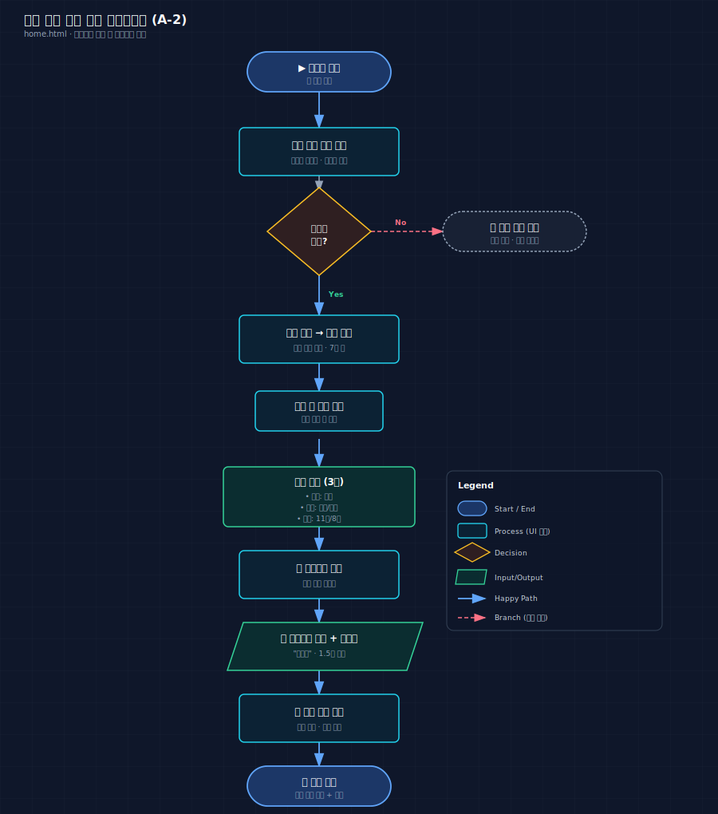
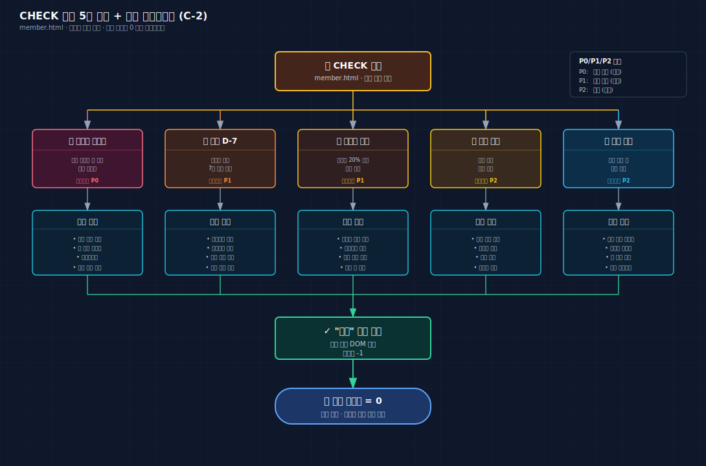
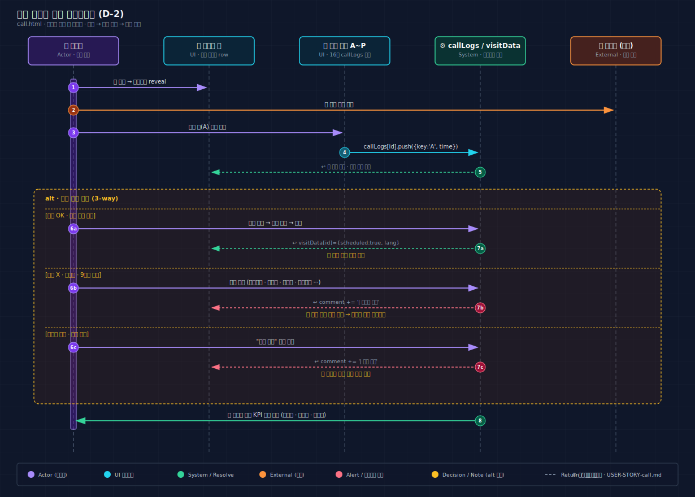
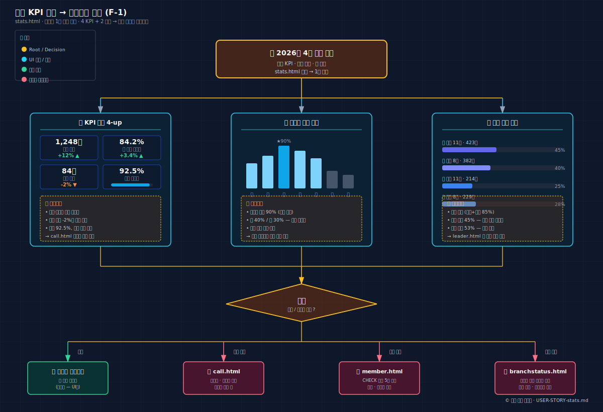

# 1. 프로젝트 개요

## 한 줄 정의

> 어학원(영어/일어) **하남 지점**의 멤버, 리더, 출석, 팀 스케줄, 멤버십을 통합 관리하는 어드민 시스템.

| 항목 | 내용 |
|------|------|
| 주요 사용자 | 지점장(메인), 매니저(서브) |
| 진입 경로 | 사이드 드로어 메뉴(햄버거) |
| 운영 단위 | 영어 5팀 + 일어 5팀 = 10팀 / 리더 60명 / 멤버 1,500명 |
| 동시 처리 흐름 | 일별 출석 → 알림 대응 → 통화/예약 → 매출/통계 |

## 기술 스택과 구조

- 프레임워크 없음. **HTML / Vanilla JS / CSS**.
- 스타일은 Tailwind(CDN) + Pretendard 폰트, 아이콘은 Phosphor Icons(unpkg CDN).
- 데이터는 클라이언트 사이드 **Mock**. 백엔드 미연동.
- SPA 아님. 6개 HTML 파일이 각각 독립 페이지로 동작하며, 사이드 드로어가 동일 패턴으로 공유된다.
- 각 HTML 파일은 `<script>` 태그 안에 모든 JS가 인라인으로 포함되어 있고, 별도 `.js` 파일이 없다.

## 도메인 핵심 규칙 (3종 색인)

### 멤버십 등급 (5단계)

| 등급 | 총 세션 | 행 색상 | 비고 |
|------|---------|---------|------|
| VVIP | 1,040회 | `bg-purple-50` | 최상위 |
| VIP | 520회 | `bg-indigo-50` | 고관여 |
| A+ | 104회 | `bg-emerald-50` | 표준 다수 |
| H+ | 52회 | `bg-orange-50` | 단기 |
| B (= T) | 24회 | `bg-slate-50` | 입문/체험 |

> branchstatus는 `T`로, 다른 페이지는 `B`로 표기. 의미는 동일(24회 입문). 향후 통일 권장.

### 리딩 레벨 (5단계)

| 레벨 | 메인 색상 | 적용 |
|------|----------|------|
| LV0 | 슬레이트 | 입문 |
| LV1 | 에메랄드 | 초급 |
| LV2 | 블루 | 중급 |
| LV3 | 퍼플 | 상급 |
| LV4 | 앰버 | 최상급 |

### 출석 상태 (5종)

| 상태 | 배지 | 흐름 |
|------|------|------|
| 출석예정 | 슬레이트 | 기본 상태 |
| 출석완료 | 에메랄드 | 금일 출석 클릭 후 |
| 대타예정 | 앰버 | 대타 배정됨 |
| 대타출석완료 | 앰버+체크 | 대타 도착 |
| 불참 | 레드 | 사전 통보됨 |

## 6개 페이지 한눈에

| # | 파일 | 한 줄 역할 | 핵심 가치 |
|---|------|---------|----------|
| 2 | `home.html` | 지점장 통합 현황판 | 1분 현황 파악 + 원클릭 대응 |
| 3 | `leader.html` | 리더(60명) 출석부 | 팀별 출석 한눈에 + 불참→대타 워크플로우 |
| 4 | `member.html` | 멤버(1,500명) 출석부 | CHECK 알림 우선 대응 + 멤버십 만료 선제 관리 |
| 5 | `branchstatus.html` | 지점 회원·매출 현황 | 기준일 토글 + 환불 3유형 안전 처리 |
| 6 | `call.html` | 신규 회신 워크벤치 | 한 클릭 콜로그 + 결과 자동 아카이브 |
| 7 | `stats.html` | 월간 통계 | 4-KPI 1분 판단 + 후속 페이지 드릴다운 |

## 페이지 간 흐름 (요약)

```
유입 (광고/지인)
   ↓
call.html         신규 지원자 회신·예약
   ↓
home.html         내일 신규 멤버 리마인드
   ↓
leader.html       리더 출석 / 대타
member.html       학생 출석 / CHECK 알림
   ↓
branchstatus.html 회원·매출 코호트 분석
   ↓
stats.html        월간 KPI 판단 → 다른 페이지로 드릴다운
```

각 페이지는 독립적으로 동작하지만, 운영 흐름상 **신규 회신 → 등록·일정 → 일별 출석 → 회원·매출 → 월간 KPI** 의 순서로 데이터가 누적된다.

---

# 2. home.html — 대시보드 홈

## 한 줄 정의

> 지점장이 출근 직후 1분 안에 오늘의 리더·신규멤버·일정을 파악하고, 원클릭으로 후속 액션을 트리거하는 **통합 현황판**.

| 항목 | 내용 |
|------|------|
| 주요 Actor | 지점장(메인), 매니저(서브) |
| 진입 경로 | 앱 최초 진입 시 기본 페이지 |
| 핵심 가치 | 1분 현황 파악 / 원클릭 대응 / 월간 한눈에 |

## 핵심 기능

- **공지사항 위젯**: 10초 주기 자동 스크롤. 중요도 색상 도트(빨강/파랑) + 제목 + 날짜.
- **리더 현황 보드 위젯**: 오늘 배정된 리더 목록과 상태 요약(출석예정/완료/대타/불참 카운트). "크게 보기"로 7일 모달 오픈.
- **당일 첫방문 스터디**: 오늘 첫 스터디 참여하는 멤버 이름과 반 정보 리스트.
- **내일 신규 멤버 리마인드**: 발송 대상 아바타 스택 + "전체 퀵 전송" 일괄 발송 버튼.
- **월간 캘린더**: 7×6 그리드. 신규등록(파랑), 상담(초록), 행사(주황) 색상 코드. 전화번호 클릭 시 클립보드 복사 + 토스트 1.5초.

## 주요 사용자 시나리오

### A-1. 출근 후 오늘 현황 파악 (P0)

> "출근하자마자 오늘 하루를 1분 안에 그림으로 잡고 싶다."

1. 앱 진입 → 자동으로 home.html 로드.
2. 공지사항 위젯에서 자동 스크롤되는 중요 공지 확인.
3. 리더 현황 위젯의 상태 요약 바에서 출석예정/완료/불참 카운트 일별 점검.
4. 당일 첫방문 위젯에서 오늘 신규 멤버 이름 확인.
5. 내일 리마인드 위젯의 발송 대상 인원 수 확인.
6. **완료 조건**: 1분 내에 오늘의 그림이 머릿속에 잡힘.

### A-2. 리더 현황 상세 확인 (7일) (P1) — 페이지 핵심 워크플로우

> "이번 주 어떤 리더가 불참인지, 누구에게 대타 요청할지 파악하고 싶다."

1. 리더 현황 위젯 → "크게 보기" 클릭 → 모달 오픈.
2. 오늘 탭이 기본 활성. 좌우 화살표 또는 모바일 스와이프로 ±6일 탭 전환.
3. 상태 필터에서 "불참"만 토글 → 불참 리더만 노출.
4. 언어 필터(영어/일어), 시간 필터(11시/8시) 추가 적용.
5. 리더 행의 전화번호 클릭 → 클립보드 복사 + 토스트.
6. 통화 → 대타 배정 → 모달의 메모 셀에 결과 인라인 입력 후 포커스아웃 자동 저장.

## 화면 흐름 다이어그램



*Figure 1: home.html 리더 현황 보드 모달의 7일 탭 + 다중 필터 + 전화번호 복사 흐름.*

## 도메인/UI 특이점

- **Mock 데이터**: 40명 리더가 새로고침마다 랜덤 생성(`Math.random` 기반). 시연마다 다른 이름이 노출된다.
- **프로필 모달 통계 5열**: 최초등록일, 멤버십(잔여), 시작일, 만료(예정), 최근출석률.
- **상담 코멘트**는 인디고 박스, **히스토리 타임라인**은 색상 도트 + 잔여횟수 태그 + 상세설명.
- **메모 인라인 편집**: `contenteditable` + 포커스아웃 시 `_homeSaveMemo()` 자동 저장.
- 캘린더는 **2026년 4월 고정**. 월 전환과 주간 뷰는 미구현.

## 화자 노트

> 이 페이지의 핵심 메시지는 "**대시보드는 정보를 보여주는 곳이 아니라, 대응을 시작하는 곳**"이라는 것이다. 위젯 4개는 모두 "이 다음 어디로 갈지"를 결정하기 위한 입구다. 리더 현황 → 모달 → 전화번호 복사 → 통화의 4단계가 1분 안에 끝나는 것이 페이지의 성공 기준.

---

# 3. leader.html — 리더 팀 출석부

## 한 줄 정의

> 60명 리더의 팀별/날짜별 출석을 한 화면에서 추적하고, **불참 → 대타** 워크플로우를 클릭 몇 번에 마무리하는 출석부.

| 항목 | 내용 |
|------|------|
| 주요 Actor | 지점장(대응), 매니저(체크) |
| 진입 경로 | 사이드 메뉴 → "리더 팀" |
| 핵심 가치 | 팀별 출석 한눈에 / 불참→대타 워크플로우 / 인라인 메모 즉시 저장 |

## 핵심 기능

- **팀 탭 네비게이션 (sticky)**: 전체 / 영어(월11, 월8, 화11, ..., 일11) / 일어(동일 구조). 가로 스크롤.
- **리더 현황 보드** (좌측 2/3): 7일 날짜 탭 + 언어·시간·상태 멀티필터 + 8열 그리드 리더 행. 모바일에서는 좌우 50px 스와이프로 날짜 전환.
- **리더 불참 일정 보드** (우측 1/3): 빨간 테마(`bg-red-50`). 불참 리더 카드 + 날짜별 체크박스. 체크 시 취소선 + 초록 전환, 전체 해결 시 0.4s 페이드아웃.
- **출석 테이블** (9열): 회원정보 / 리딩LV / 리딩팀 / 출석·불참·대타 카운트 / 메모 / 8블록 출석률 / 금일출석 / 액션.
- **검색/정렬/벌크 액션**: 이름·연락처 검색, 8종 정렬, 일괄 문자/이동/삭제(체크박스 다중 선택 시 노출).

## 주요 사용자 시나리오

### B-1. 특정 팀 리더 출석부 확인 (P0)

> "영어 화 8시 팀의 리더가 누가 안 나오고 있는지 보고 싶다."

1. 사이드 메뉴 → "리더 팀" 진입(전체 탭 활성).
2. "영어 화 8시" 탭 클릭 → 해당 팀 필터링.
3. 출석 테이블에서 출석/불참/대타 수치 확인.
4. 출석 블록 호버 → 회차별 툴팁(날짜·상태·참여 멤버).
5. 빨간 % 표시(`< 40%`) 리더 식별 → 추적 메모 추가.

### B-2. 불참 리더 대응 및 대타 관리 (P1) — 페이지 핵심 워크플로우

> "불참 통보 받은 리더의 일정을 확인하고, 대타를 배정해서 빨리 정리하고 싶다."

1. 좌측 보드 상태 요약 바에서 "불참" 클릭 → 보드 필터 적용.
2. 우측 불참 일정 보드에서 해당 리더 카드 확인. LV·팀·전화번호 한눈에.
3. 전화번호 클릭 → 클립보드 복사 + 토스트.
4. 통화로 대타 요청 → 대타 확정.
5. 우측 보드의 해당 날짜 체크박스 클릭 → 취소선 + 초록 체크 전환.
6. 모든 불참 날짜 해결 시 행 페이드아웃 제거.

## 화면 흐름 다이어그램


*Figure 2: 좌측 현황 보드 → 우측 불참 일정 보드 → 전화번호 복사 → 대타 배정 → 체크박스 해결의 5단계 시퀀스.*

## 도메인/UI 특이점

- **Mock 데이터**: 60명 리더 랜덤 생성(`Math.random`). 새로고침 시마다 다름.
- **팀 색상 규칙**: 영어 보라(`#9B59B6`), 일어 파랑(`#007BFF`).
- **출석률 색상 규칙**: ≥70% 초록 / 40~69% 주황 / <40% 빨강.
- **출석 블록**은 고정 8회차. member.html(가변 8/16)과의 차이점.
- **출석 상태 전이**: 출석예정 → (출석완료 / 불참 → 대타예정 → 대타출석완료) 의 상태 머신.
- **공통 패턴**: 행 호버 `translateY(-1px) + shadow`, 메모 contenteditable, 프로필 모달.

## 화자 노트

> leader.html은 좌·우 두 보드의 **역할 분리**가 설계 핵심이다. 좌측은 "어떤 상태인지 보는 곳", 우측은 "지금 무엇을 해야 하는지의 to-do 리스트". 빨간 테마는 우연이 아니라, 시각적 우선순위를 강제하는 장치. 체크박스가 0.4초 페이드아웃으로 사라지는 것은 사용자에게 "처리 완료" 피드백을 주기 위한 작은 연출.

---

# 4. member.html — 멤버 팀 출석부

## 한 줄 정의

> **1,500명 멤버**를 팀×레벨 격자로 펼쳐 놓고, **CHECK 알림**으로 우선순위 높은 케이스만 골라 즉시 대응하는 출석부.

| 항목 | 내용 |
|------|------|
| 주요 Actor | 지점장(대응), 매니저(체크) |
| 진입 경로 | 사이드 메뉴 → "멤버 팀" |
| 핵심 가치 | CHECK 알림 우선 대응 / 레벨별 섹션 / 멤버십 만료 선제 관리 |

## 핵심 기능

- **팀 탭 (sticky top:61)**: 영어 5팀 + 일어 5팀 = 10팀(예: `영_월수_11`, `일_화목_8`).
- **레벨 Quick-Nav (sticky top:105)**: LV0~LV4 점프 버튼 + 레벨별 인원 수. smooth scroll로 해당 섹션 이동.
- **CHECK 알림 5종**: 첫방문 미체크(빨강), 만료 D-7(주황), 출석률 부진(앰버), 결제 확인(노랑), 홀딩 복귀(하늘). "해결" 버튼 클릭 시 DOM 제거 + 카운트 -1.
- **레벨별 섹션** (LV0~LV4 ×5): 각 30명, 색상 헤더, 독립 테이블.
- **출석 테이블 (9열)**: 멤버십 등급 + 잔여/총 + 만료일 / 리딩팀 / 가변 출석 블록(주2회=8, 주4회=16) / 메모 / 출석률 / 금일출석.

## 주요 사용자 시나리오

### C-2. CHECK 알림 대응 (P0) — 페이지 핵심 가치

> "오늘 처리해야 할 케이스(첫방문·만료·부진)를 알림 한 곳에서 처리하고 싶다."

1. 페이지 상단 CHECK 섹션 진입.
2. 알림 유형별로 분기:
   - **첫방문 미체크**: 멤버 이름 클릭 → 행 자동 스크롤 + 하이라이트 → 금일 출석 버튼.
   - **만료 D-7**: 전화번호 복사 → 연장 등록 안내 통화 → 메모 갱신.
   - **출석률 부진**: 멤버 이름 → 프로필 모달 → 히스토리 확인 → 독려 상담.
   - **결제 확인**: 결제 정보 검증.
   - **홀딩 복귀**: 환영 메시지.
3. 각 케이스 처리 후 "해결" 버튼 클릭 → 알림 제거.
4. **완료 조건**: 알림 카운트 0.

### C-3. 멤버십 만료 임박 관리 (P1)

> "H+ 등급 중 만료 임박 멤버를 골라 연장 안내한다."

1. 정렬 셀렉트에서 "만료 임박순" 선택.
2. 멤버십 필터에서 "H+" 선택.
3. 결과 행에서 멤버 이름 클릭 → 프로필 모달.
4. 잔여 세션 + 만료일 + 상담 코멘트 검토.
5. 하단 "개별 문자" 버튼 → SMS 발송.

## 화면 흐름 다이어그램



*Figure 3: CHECK 알림 5종이 각각 어떤 행동(행 스크롤, 전화 복사, 프로필 확인, 결제 검증, 환영 메시지)으로 분기되는지의 분해도.*

## 도메인/UI 특이점

- **Seeded PRNG (Mulberry32)**: `hash(teamKey + "_" + level)` 시드로 30명 결정적 생성. **새로고침해도 동일 데이터** 유지. 시연·테스트 일관성 보장이 의도된 설계.
- **출석 블록 가변**: 주 2회 멤버는 8블록, 주 4회 멤버는 16블록. leader.html의 고정 8과 차이점.
- **CHECK 알림은 데이터 생성 시 랜덤 할당**. 실시간 조건 기반 감지가 아니라 Mock 시드에서 정해짐.
- **leader.html과의 차이**(요약): 대상(60→1,500), 팀 구조(요일+시간 → 일정+시간), 레벨 그룹핑 유무, 현황 보드 유무, CHECK 알림 유무, 멤버십 표시 유무.
- **상호작용 트리거**: 팀 배지 클릭 → `navigateToTeam()` 으로 해당 팀 탭 자동 전환.

## 화자 노트

> 1,500명을 한 화면에 펼쳐도 사용자가 길을 잃지 않는 이유는 두 개의 sticky 네비게이션(팀 탭 + 레벨 Quick-Nav)과 CHECK 알림 섹션이 **"어디로 가야 할지"를 항상 위에 띄워주기 때문**이다. 알림이 "오늘 무엇을 해야 하는가"의 답이고, Quick-Nav가 "그곳으로 어떻게 점프하는가"의 답이다.

---

# 5. branchstatus.html — 지점 회원·매출 현황

## 한 줄 정의

> 기준일(자료등록·결제·스터디시작)을 토글해 가며 지점의 방문객·매출·전환·환불을 한 화면에서 풀어내는 **회계 친화 대시보드**.

| 항목 | 내용 |
|------|------|
| 주요 Actor | 지점장(메인), 매니저(서브) |
| 진입 경로 | 햄버거 메뉴 → "Branch Status" |
| 핵심 가치 | 기준일 토글로 재무 모드 / 환불 3유형 안전 처리 / 다중 필터 코호트 |

## 핵심 기능

- **기준일 셀렉트**: 자료등록일(운영 모드) / 결제일(재무 모드, 월 매출 정합성) / 스터디시작일(재무 모드, 운영 부하). 변경 시 KPI·차트·테이블 모두 리렌더.
- **4-KPI 그리드**: 총 방문자, 멤버 가입률, 총 매출, 평균 객단가.
- **2-탭 차트**: 매출 대시보드(결제방식·멤버십·상태) / 유입 분석(경로별 인원·전환율).
- **방문객 테이블 (14컬럼)**: 다중 필터(상태 칩, 멤버십, 경로, 결제방식, 기간, 검색).
- **환불 처리 모달 (3유형)**: 전체 취소(full) / 부분 취소(partial) / 환불 정산 입금(deposit). 사유 칩 + 자유 입력.

## 주요 사용자 시나리오

### E-1. 환불 처리 (3유형) (P0) — Hero

> "환불 요청이 들어왔을 때, 결제 정보를 보면서 전체/부분/정산 중 맞는 유형을 골라 사유까지 한 번에 닫고 싶다."

1. 테이블 행 → "추가" 드롭다운 → "환불" 클릭.
2. 환불 처리 모달 오픈. 기존 결제 정보(방식·금액·일자) 표시.
3. 환불 유형 선택:
   - **전체 취소**: 금액 자동(결제금액).
   - **부분 취소**: 부분 금액 입력.
   - **정산 입금**: 정산 비용 + 결제일 + 결제방식 + 환불 금액 + 처리일.
4. 환불 방식(카드/계좌/현금/토스) + 처리일 + 사유 칩(또는 자유 입력) 선택.
5. "환불 처리" 버튼 → `history += 환불 항목`, `extras += 환불 항목`, `amount -= 환불 금액`.
6. `renderAll`로 KPI/차트/테이블 갱신 + 토스트 + 모달 닫힘.

### E-2. 기준일 전환으로 재무 모드 분석 (P0)

> "같은 회원 데이터라도 결제일 기준으로 보면 이번 달 매출이, 시작일 기준으로 보면 운영 부하가 다르게 보인다."

1. 상단 기준일 셀렉트 → "결제일" 선택.
2. 재무 뱃지 표시 + 활성 컬럼 황색 강조.
3. 결제일이 null인 회원 자동 제외 → `renderAll`.
4. 기간/상태 필터 추가 → 코호트 좁힘.

## 화면 흐름 다이어그램


*Figure 4: 환불 요청 → 모달 → 3유형 분기 → 사유 칩/처리일 → history+extras+amount 동시 업데이트 → renderAll 갱신의 풀 시퀀스.*

## 도메인/UI 특이점

- **Mock 데이터**: 20명 방문객을 `genVisitors`로 생성.
- **회원 상태 4종 + 환불 뱃지**: 멤버(에메랄드), 미가입(슬레이트), 디파짓(앰버), 스텝(퍼플), 환불(레드 뱃지, history 기반).
- **유입경로 6종 색상**: 카카오(노랑), 네이버(초록), 인스타(마젠타), 지인소개(슬레이트), 워크인(오렌지), 전화문의(인디고).
- **환불 3유형의 핵심**은 데이터 일관성: 단일 트랜잭션에서 history·extras·amount 세 개의 필드가 동시에 업데이트되어야 KPI가 어긋나지 않는다.
- **등급 표기 차이**: 이 페이지만 `T`로 표기(다른 페이지는 `B`). 의미는 동일(24회 입문). 향후 통일 권장.

## 화자 노트

> branchstatus는 운영 화면이 아니라 **회계 대시보드**다. 같은 회원이라도 "언제 자료를 받았는가", "언제 결제했는가", "언제 시작했는가" 세 시점이 모두 다르고, 보고 받는 사람의 역할에 따라 답이 달라진다. 기준일 토글이 그 모드 전환의 핵심 장치. 환불 모달의 3유형은 회계 실무에서 흔히 발생하는 패턴 — 단순 취소가 아니라 정산 후 잔액 환불 같은 케이스가 누락되면 데이터가 어긋난다.

---

# 6. call.html — 신규 회신 통합 관리

## 한 줄 정의

> 신규 지원자 한 명 한 명에 대한 통화 기록·결과 코딩·예약 확정·분석을 한 화면에서 처리하는 **통합 콜백 워크벤치**.

| 항목 | 내용 |
|------|------|
| 주요 Actor | 매니저(메인), 지점장(분석/감독) |
| 진입 경로 | 햄버거 메뉴 → "신규 회신" |
| 핵심 가치 | 한 클릭 콜로그 / 결과 자동 아카이브 / 데이터 보드 분석 |

## 핵심 기능

- **신규 지원자 메인 테이블**: 이름 / 전화 / 회신자 / 결과 / 예약 / 동기.
- **직원 토글 A~P**: 통화 시 직원 키 클릭 → `callLogs[id]` 누적 → 행 배경 초록(회신 완료).
- **결과 코딩 9사유 + 1**: 없는번호 / 타지역 / 잘못누름·관심없음·바로끊음 / 직접콜탁(보류) / 시기미스 / 미성년자 / 기존멤버(중복) / 나이(80대+) / 기타(자유 입력) + "최후 통첩"(별도 아카이브).
- **3-탭 카드**: 캘린더(월간 상담 일정 색상별) / 예약 히스토리(기간·결과·경로 필터) / 데이터 보드(KPI·시계열·유입경로·직원별).
- **모달 4종**: 시간 피커(달력+30분 단위), 입력 모달(이름 수정·기타 사유), 중복 지원자, 신규 지원자 추가.

## 주요 사용자 시나리오

### D-2. 콜백 → 결과 코딩 → 예약 확정 (P0) — Hero

> "전화 한 통 돌리고, 결과를 한 클릭으로 분류하고, 예약이 잡히면 그 자리에서 일정까지 닫고 싶다."

1. 메인 테이블 행 클릭 → 전화번호 reveal.
2. 외부 통화 시도.
3. 직원 토글(A~P 중 본인 키) 클릭 → `callLogs[id].push({key, time})` → 행 배경 초록.
4. 분기:
   - **응답 OK + 상담 의향**: 시간 피커 → 언어 선택(영어/일본어/둘 다) → "확정" → `visitData[id] = {scheduled:true, lang}` → "예약 확정" 뱃지.
   - **응답 X + 부적합**: 결과 코딩(9사유 중 1개) → `comment += '| 전화상 안함'` → 메인 목록에서 자동 분리.
   - **마지막 시도**: "최후 통첩" 표시 → 데이터 보드 우측 별도 아카이브.
5. 데이터 보드 KPI 자동 갱신.

### D-1. 신규 지원자 등록 + 빠른 회신 (P0)

> "광고 보고 막 들어온 지원자를 1초 안에 시스템에 넣고 통화 가능 상태로 만들고 싶다."

1. 헤더 "+ 신규 지원자 추가" 버튼 클릭.
2. 성함 + 연락처 입력 + 지원 동기 선택(카카오/네이버/인스타/SNS/지인).
3. 상담 일정 미정 → 그대로 등록(회신 대기). 확정 → 달력 + 시간 + 언어 선택.
4. 메인 테이블 최상단에 신규 행 노출 → 통화 가능.

## 화면 흐름 다이어그램



*Figure 5: 매니저가 행을 클릭한 순간부터 callLogs/visitData/comment가 어떻게 업데이트되는지의 시퀀스. 응답 OK / 응답 X / 최후 통첩의 3분기.*

## 도메인/UI 특이점

- **Mock 데이터**: 20명 지원자를 `populateInitial`로 생성.
- **callLogs/visitData**는 인메모리 저장. 직원 이름과 빠른 시간만 localStorage에 영속화.
- **결과 코딩의 자동 아카이브**: `comment.includes('전화상 안함')` 인 행은 메인 테이블에서 사라지고 데이터 보드 아카이브로 자동 이동. 매니저는 결과 분류만 하면 정리는 시스템이 한다.
- **캘린더 색상**: 영어(보라), 일본어(파랑), 둘 다(인디고).
- **데이터 보드 KPI 4종**: 총 지원자 / 총 회신율 / 예약 성공률 / 성공 평균 회신 수. K2 클릭 시 회신자 목록 + 소요 시간, K3 클릭 시 예약확정자 상세.

## 화자 노트

> call.html은 콜센터 워크벤치지만, **단순 기록이 아니라 분류·아카이브·분석을 하나의 화면에서 끝내는 것**이 차별점이다. 직원 토글의 한 클릭이 콜로그를 누적하고, 결과 코딩 한 번이 아카이브 분리를 트리거하며, 그 결과가 데이터 보드 KPI를 즉시 갱신한다. 사용자는 "기록만" 하면 되고, 분류·집계·드릴다운은 자동.

---

# 7. stats.html — 월간 통계 & 리포트

## 한 줄 정의

> 월간 4개 KPI와 요일·팀 분포 두 차트로 지점장이 1분 안에 "**이번 달 잘 돌아가고 있나?**"를 판단하는 단일 화면 통계 카드.

| 항목 | 내용 |
|------|------|
| 주요 Actor | 지점장(메인) |
| 진입 경로 | 햄버거 메뉴 → "통계 및 리포트" |
| 핵심 가치 | 월간 KPI 4-up / 요일·팀 분포 한눈에 / 이상치 발견 시 다른 페이지로 드릴다운 |

## 핵심 기능

- **4-KPI 그리드**: 활성 멤버(1,248명, +12% ▲), 월 평균 출석률(84.2%, +3.4% ▲), 신규 등록(84명, -2% ▼), 매출 달성도(92.5% 진행바).
- **요일별 출석 추이**: 월~일 7개 막대. 피크(수요일 90%), 저조(토일 30~40%) 시각화.
- **팀별 분배 현황**: 영어(85% = 오전 45 + 저녁 40), 일어(53% = 오전 25 + 저녁 28) 수평 진행바.
- **액션바**: 월 셀렉트(미구현), 리포트 다운로드 버튼(미구현, PDF/Excel).

## 주요 사용자 시나리오

### F-1. 월간 KPI 검토 → 인사이트 도출 (P0) — Hero

> "이번 달 지점이 정상 운영 중인지, 어디가 약한지 한 화면으로 보고 후속 페이지로 흩어지고 싶다."

1. 햄버거 → "통계 및 리포트" 진입.
2. KPI 4-up 검토:
   - 활성 멤버 ↑ → 정상.
   - 출석률 ↑ → 정상.
   - 신규 등록 ↓ → **이상치**.
   - 매출 달성도 → 진행바 시각.
3. 신규 등록 부진 → call.html 드릴다운(회신 효율 점검).
4. 출석 저조 발견 시 → member.html(CHECK 알림 확인).
5. 매출 미달 발견 시 → branchstatus.html(코호트 분석).

### F-2. 요일/팀별 분배 차트로 운영 패턴 파악 (P1)

> "수요일이 만석에 가깝고 토일이 비는 패턴이 계속된다면, 정원 조정이나 새 시간대 검토가 필요하다."

1. 요일별 출석 추이 → 피크(수요일 90%) + 저조(토일 30~40%) 식별.
2. 팀별 분배 → 영어 85%, 일어 53% 비중 파악.
3. 영어 오전 정원 압박 → 리더 추가 영입 검토.
4. 토일 슬롯 활용도 낮음 → 프로모션/이벤트 검토.

## 화면 흐름 다이어그램



*Figure 6: KPI 4-up과 두 차트에서 발견된 이상치가 어느 페이지의 드릴다운으로 연결되는지의 라우팅 맵.*

## 도메인/UI 특이점

- **현재는 정적 모킹**. 실제 home/leader/member 데이터 집계는 미연동.
- **KPI 변화율 색상**: ▲ 증가 = 에메랄드, ▼ 감소 = 앰버.
- **차트 색상**: 피크(수요일) = `brand-500` (`#0ea5e9`), 평일 = brand-100, 주말 = slate-100.
- **미구현 표기 컨벤션**: 점선 빨강 테두리(`stroke-dasharray:3 3`) + "(미구현)" 주석.
- **리포트 다운로드**는 UI만 존재. 후속 작업으로 PDF/Excel 라이브러리 도입 필요.

## 화자 노트

> stats.html은 **단독으로 완결되는 페이지가 아니다**. 4개 KPI 중 하나라도 이상하면 사용자는 다른 페이지로 떠나야 한다. 따라서 이 페이지의 성공 기준은 "1분 안에 어느 페이지로 가야 할지 판단할 수 있는가"이고, 그래서 차트가 단 두 개뿐이다 — 더 보여주면 판단을 흐린다.

---

# 8. 알려진 제약 & 다음 단계

## 알려진 제약 (Known Limitations)

| 영역 | 제약 |
|------|------|
| 데이터 | 모든 페이지가 클라이언트 사이드 Mock. 백엔드 미연동 |
| home 캘린더 | 2026년 4월 고정. 월 전환·주간 뷰 미구현 |
| home 공지사항 | 하드코딩 2개. CRUD 미구현 |
| home 리마인드 | SMS/메시지 발송 미연동 (`openSmsModal()` 호출만) |
| leader/member 검색 | UI만, 실시간 필터 JS 부분 구현 |
| leader/member 드래그 정렬 | 핸들 UI만, 드래그앤드롭 미구현 |
| leader 캘린더 모달 | `openCalendarModal()` 호출만, 모달 미구현 |
| leader/member SMS 모달 | `openSmsModal()` 호출만, 모달 미구현 |
| leader/member 액션 드롭다운 | 점3개 버튼만, 메뉴 항목 미구현 |
| member CHECK 알림 | 데이터 생성 시 랜덤 할당. 실시간 조건 감지 아님 |
| member 히스토리 | 프로필 모달 히스토리는 템플릿 기반 (3개 고정) |
| branchstatus 등급 표기 | 다른 페이지가 `B`인데 이 페이지만 `T`. 통일 필요 |
| call 데이터 영속화 | callLogs/visitData는 인메모리. localStorage는 직원 이름/빠른 시간만 |
| stats 데이터 | 정적 모킹. home/leader/member에서 실데이터 집계 미구현 |
| stats 리포트 | PDF/Excel 다운로드 UI만 존재 |

## 백엔드 연동 시 우선순위

1. **member의 CHECK 알림 실시간 조건 감지**: 만료 D-7, 출석률 부진, 결제 미확인은 실데이터에서 자동 감지되어야 함.
2. **call의 callLogs/visitData 영속화**: 새로고침 시 사라짐 → DB 저장 필요.
3. **stats의 실데이터 집계**: home/leader/member의 일별 데이터를 월간 집계로 롤업.
4. **leader 출석 데이터 연동**: 현재 60명이 새로고침마다 다름 → 실제 리더 명단 고정 필요.
5. **branchstatus 환불 처리의 트랜잭션 보장**: history+extras+amount 동시 업데이트가 단일 트랜잭션이어야 데이터 일관성 유지.
6. **공통 인프라**: SMS 발송 게이트웨이, 캘린더 모달 통합, 검색·정렬 서버사이드 처리.

## 페이지 ↔ 문서 동기화 규칙

CLAUDE.md의 핵심 규칙: HTML을 수정하면 대응 docs도 함께 업데이트한다.

- `home.html` → `docs/PRD-home.md`, `docs/USER-STORY-home.md`
- `leader.html` → `docs/PRD-leader.md`, `docs/USER-STORY-leader.md`
- `member.html` → `docs/PRD-member.md`, `docs/USER-STORY-member.md`
- `branchstatus.html` → `docs/USER-STORY-branchstatus.md`
- `call.html` → `docs/USER-STORY-call.md`
- `stats.html` → `docs/USER-STORY-stats.md`
- UI 흐름/시나리오 변경 시 `USER-SCENARIOS.md`, `ONBOARDING.md`도 검토.

이 발표 자료(`PRESENTATION.md`)도 동일 규칙을 따른다 — 페이지 변경이 있으면 함께 갱신할 것.

## 마무리

이 어드민의 설계 원칙은 명료하다.

1. **각 페이지는 하나의 답을 준다**. home은 "지금 무엇이 일어나고 있나", leader는 "리더 출석", member는 "학생 출석", branchstatus는 "회원·매출", call은 "신규 회신", stats는 "월간 판단". 페이지를 섞지 않는다.
2. **알림과 sticky 네비게이션이 길찾기를 대신한다**. CHECK 알림, Quick-Nav, 팀 탭은 모두 "어디로 가야 하는지"를 사용자가 매번 결정하지 않게 만든다.
3. **데이터 일관성은 단일 트랜잭션**. 환불 처리의 history+extras+amount, 콜백의 callLogs+visitData+comment는 한 번의 액션으로 함께 움직인다.
4. **시각 신호는 의미를 가진다**. 멤버십 등급 5색, 리딩 레벨 5색, 출석 상태 5색, 유입경로 6색은 모두 도메인 사전에 정의된 색상 코드. 우연이 아니다.

발표를 들은 사람이 가지고 가야 할 단 한 가지는: "이 어드민은 정보를 보여주는 도구가 아니라, 매일의 운영 결정을 닫아주는 도구다."
