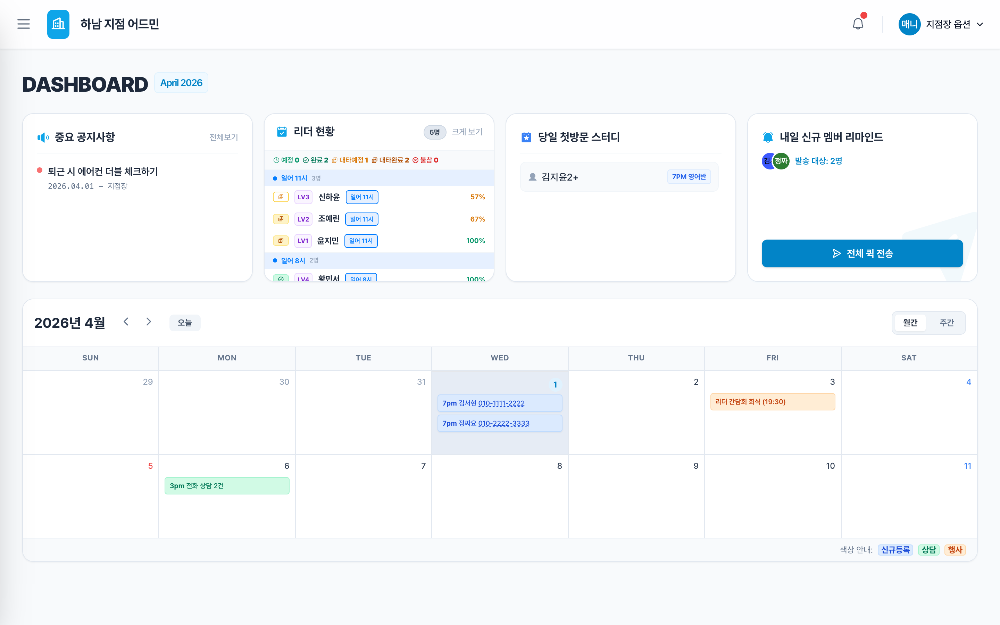
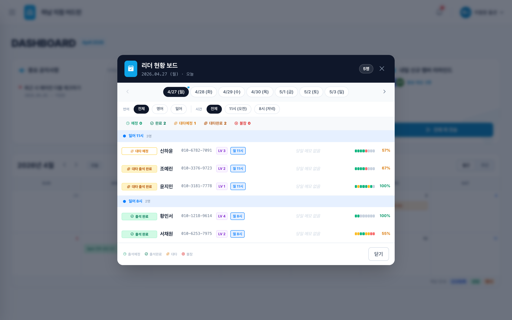
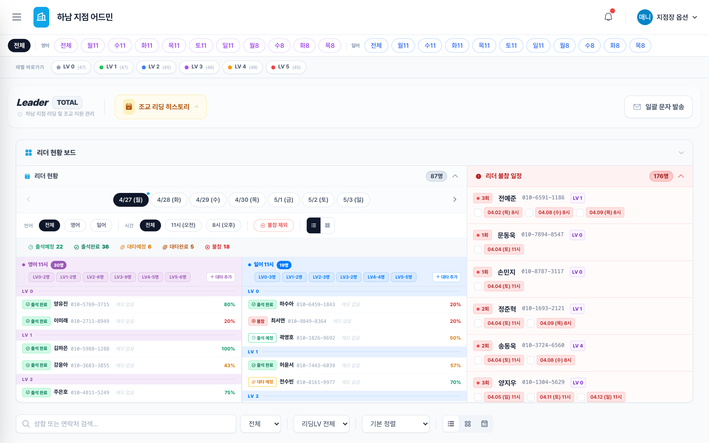
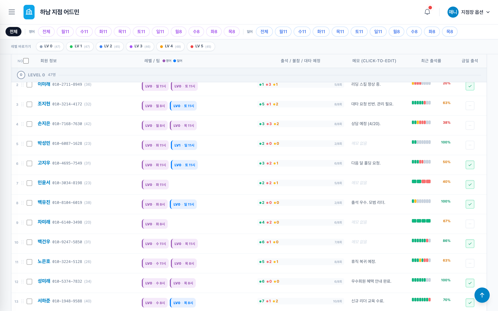
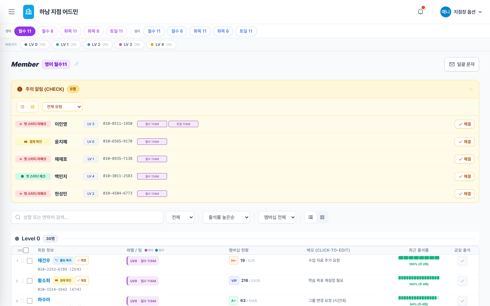
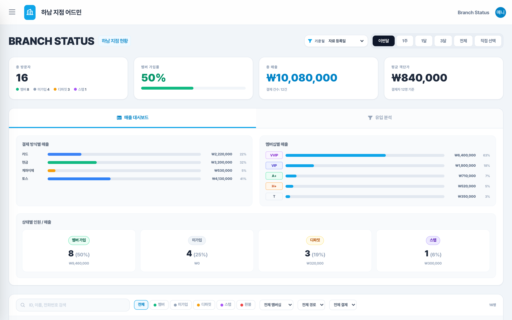
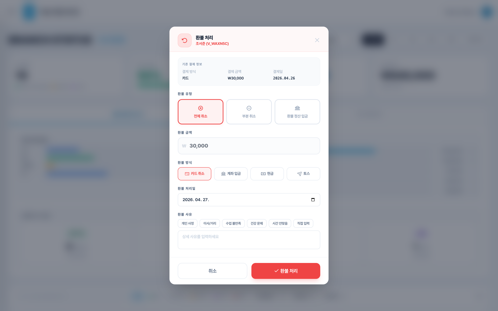
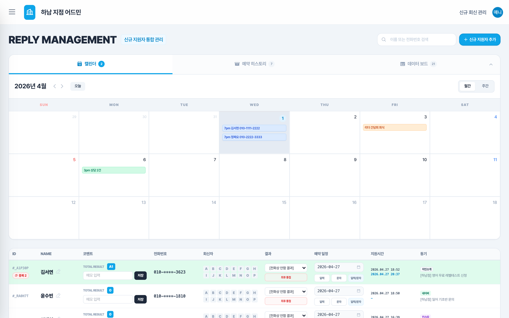
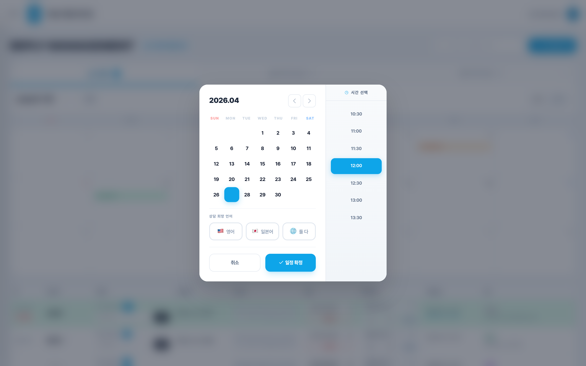
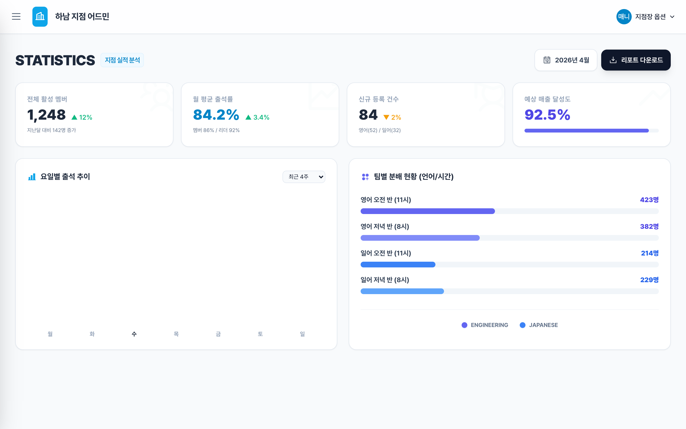

# 하남 지점 어드민 사용 안내

## 매니저님께

안녕하세요. 하남 지점 어드민을 만든 기획팀입니다.

오늘 매니저님께서 매일 보시게 될 6개 화면을 차례로 안내드릴게요. 각 화면이 **언제** 사용되고, **무엇을 할 수 있고**, **어떻게 하면 되는지**를 실제 화면 그대로 보여드릴게요.

먼저 전체 그림부터 잡아 드리고, 그다음 화면 하나씩 들여다보겠습니다.

## 하루 운영의 흐름

매니저님의 하루는 보통 이런 순서로 흘러갑니다.

```
출근 직후              → home          (오늘 현황 1분 점검)
오전 수업 직전·중       → leader        (리더 출석 / 대타 챙기기)
오전~오후 상시          → member        (멤버 출석 / CHECK 알림 처리)
저녁 마감 / 주간        → branchstatus  (회원·매출 정리, 환불 처리)
신규 문의 들어왔을 때    → call          (회신·예약 관리)
월말                   → stats         (이번 달 성적 요약)
```

각 화면은 독립적으로 동작하지만, 데이터는 자연스럽게 이어집니다. **신규 문의가 들어와 회신을 받고(call) → 등록되면 일정에 잡히고(home) → 매일 출석을 찍고(leader/member) → 회원·매출로 쌓이고(branchstatus) → 월말에 한 줄 KPI로 요약(stats)**되는 구조예요.

## 6개 화면 한눈에

| 순서 | 파일 | 한마디로 | 사용 시점 |
|------|------|---------|----------|
| 1 | home.html | 통합 현황판 | 출근 직후 1분 점검 |
| 2 | leader.html | 리더 출석부 | 수업 전·후 리더 챙길 때 |
| 3 | member.html | 멤버 출석부 | 상시 (특히 CHECK 알림 뜰 때) |
| 4 | branchstatus.html | 회원·매출 현황 | 마감·정산·환불 처리 |
| 5 | call.html | 신규 회신 관리 | 문의·콜백·예약 잡을 때 |
| 6 | stats.html | 월간 통계 | 월말 / 분기 리뷰 |

좌측 햄버거 메뉴(☰)를 누르시면 어느 화면에서든 다른 화면으로 바로 이동하실 수 있습니다.

---

# 1. home — 출근 직후 1분 현황



## 이 화면은요

매니저님이 **출근하셔서 가장 먼저 여시는 화면**이에요. 오늘 지점에서 일어나고 있는 모든 일을 한 화면에서 파악하실 수 있도록 구성했습니다.

상단에는 4개의 위젯이 가로로 놓여 있고, 그 아래에 이번 달 캘린더가 펼쳐집니다.

## 이렇게 사용하시면 돼요

1. **공지사항 위젯** — 가장 왼쪽 위젯이에요. 본부 공지나 지점장님 메모가 자동으로 흐르며 보입니다.
2. **리더 현황 위젯** — 오늘 리더 출석 예정/완료/대타/불참 카운트가 한 눈에 보여요. 빠르게 "오늘 사람 배치가 정상이구나"를 확인하시면 됩니다.
3. **당일 첫방문 스터디 위젯** — 오늘 처음 학원에 오시는 신규 멤버 이름을 보실 수 있어요. 환영 인사 준비하실 수 있게요.
4. **내일 신규 멤버 리마인드 위젯** — 내일 첫 방문 예정인 분들 인원이 보입니다. **"전체 퀵 전송"** 버튼 한 번이면 리마인드 메시지가 일괄 발송됩니다.
5. **캘린더** — 4월 한 달의 주요 일정이 색깔로 표시돼요. **파란색=신규 등록**, **초록색=상담**, **주황색=행사**입니다.

## 더 자세히 보고 싶으실 때

리더 현황 위젯의 **"크게 보기"** 버튼을 누르시면 아래 화면이 열립니다.



위쪽 날짜 탭(4/27~5/3)을 누르시면 7일치를 미리 확인하실 수 있고, 언어/시간/상태 필터로 좁혀 볼 수도 있어요. 리더 이름을 클릭하시면 그 분의 프로필 모달이 따로 열립니다.

## 꼭 기억해 주세요

- 캘린더는 현재 **4월 고정**입니다. 월 전환은 다음 업데이트에 추가될 예정이에요.
- 리마인드 "전체 퀵 전송"은 발송 후 취소가 안 되니, 인원·문구 한 번 더 확인 부탁드려요.

---

# 2. leader — 리더 팀 출석부



## 이 화면은요

저희 지점에는 리더(튜터)가 약 60분 계시는데요, **리더분들의 출석을 팀 단위로 관리하는 전용 화면**이에요. 매일 수업 전후에 매니저님이 가장 자주 보시게 될 화면 중 하나입니다.

화면 상단의 **요일+시간 탭**(영 월11, 영 수11 …)을 눌러 팀을 전환합니다.

## 화면 구성

화면은 크게 두 부분으로 나뉘어 있어요.

- **왼쪽: 리더 현황 보드** — 오늘 기준으로 리더 한 분 한 분이 어느 상태(출석/대타예정/불참)인지 보입니다.
- **오른쪽: 리더 불참 일정 (붉은 패널)** — 앞으로 7일간 누가 빠지는지, 대타가 정해졌는지를 우선순위로 보여줍니다. **"오늘 처리해야 할 일 목록"**이라고 생각하시면 돼요.

## 이렇게 사용하시면 돼요 (대타 배정 흐름)

1. 화면 진입 → 오른쪽 붉은 패널에서 **불참자**가 누구인지 확인합니다.
2. 해당 행의 **전화번호를 클릭**하면 클립보드에 복사됩니다 (위쪽에 작은 토스트 알림이 떠요).
3. 다른 리더분께 연락해서 대타가 정해지면, 왼쪽 보드에서 해당 리더의 상태를 **대타예정**으로 바꿉니다.
4. 대타가 실제로 출석하면 **대타출석완료**로 표시됩니다.

## 출석부 테이블

스크롤을 아래로 내리시면 60명 전체 리더 명단이 보입니다.



각 행에서 보실 수 있는 것:

- **이름·전화번호·나이** (이름 클릭 → 프로필 / 번호 클릭 → 복사)
- **레벨/팀 배지** — 진행하시는 클래스
- **출석/불참/대타 카운트** — 최근 8회 기준
- **메모** — 셀을 클릭하시면 바로 입력하실 수 있어요. 다른 곳을 클릭하면 자동 저장됩니다.
- **최근 출석률**과 **금일 출석 체크박스**

## 꼭 기억해 주세요

- 메모는 **인라인 편집**입니다. 따로 저장 버튼이 없어요. 클릭 → 입력 → 다른 곳 클릭만 하시면 됩니다.
- 출석 상태 5종(예정/완료/대타예정/대타출석완료/불참)은 색깔이 다 달라요. 익숙해지시면 한눈에 보이실 거예요.

---

# 3. member — 멤버 팀 출석부



## 이 화면은요

저희 지점은 멤버(학생)가 **약 1,500분**이라 전부 한 번에 보시는 건 비효율이에요. 그래서 이 화면은 **"오늘 신경 써야 할 분"부터 위로 올려주는 구조**로 만들었습니다.

화면 상단의 팀 탭(월수11, 화목8 …)으로 멤버 팀을 전환하시고, 그 아래 **CHECK 알림 영역**이 가장 중요한 부분이에요.

## CHECK 알림 (제일 먼저 보세요)

화면 상단의 **노란색 "주의 알림 (CHECK)"** 영역에 5종 알림이 모입니다.

| 알림 종류 | 의미 | 처리 |
|----------|------|------|
| 첫 스터디 미체크 | 신규 멤버가 첫 방문했는데 체크가 안 됐어요 | 출석 체크 → "해결" |
| 결제 확인 | 결제가 들어왔는데 확인이 필요해요 | 확인 → "해결" |
| 만료 임박 | 멤버십이 D-7 안으로 끝나요 | 갱신 안내 |
| 출석률 낮음 | 최근 출석이 평소보다 떨어졌어요 | 상담 / 연락 |
| 홀딩 복귀 | 홀딩이 끝나서 복귀할 때예요 | 일정 안내 |

알림 행에서 **이름을 클릭하시면** 아래 레벨 섹션의 해당 행으로 화면이 자동 스크롤되고 노란색으로 잠깐 강조돼요. 처리 후 **"해결"** 버튼을 누르시면 알림에서 사라집니다.

## 레벨 섹션 (Level 0 ~ Level 4)

CHECK 알림 아래로 LV0~LV4 5개 섹션이 색깔별로 펼쳐집니다.

- **LV0 (회색)** — 입문
- **LV1 (초록)** — 초급
- **LV2 (파랑)** — 중급
- **LV3 (보라)** — 상급
- **LV4 (앰버)** — 최상급

각 섹션 안에서 **멤버십 등급**(VVIP/VIP/A+/H+/B)에 따라 행 배경색이 달라져요. **VVIP는 보라색**, VIP는 진한 인디고, A+는 에메랄드, H+는 주황, B는 회색이에요.


## 이렇게 사용하시면 돼요 (CHECK 알림 처리 흐름)

1. 화면 진입 → CHECK 영역에 알림이 떠 있는지 확인합니다.
2. 알림 종류별로 **이름 클릭** → 해당 멤버 행으로 점프합니다.
3. 해야 할 일을 합니다 (출석 체크 / 결제 확인 / 연락 등).
4. 알림으로 돌아와 **"해결"** 버튼을 누르면 알림이 사라집니다.

## 꼭 기억해 주세요

- 멤버 1,500명 전체를 매일 다 보실 필요는 없어요. **CHECK 알림과 만료 임박만 체크**하시면 80%는 끝납니다.
- 멤버 배지 색깔(VVIP 보라 / VIP 인디고 / A+ 에메랄드…)은 외워두시면 행 한 번만 봐도 등급이 보여요.

---

# 4. branchstatus — 지점 회원·매출 현황



## 이 화면은요

**지점의 운영·매출을 정리할 때** 보시는 화면이에요. 회원 가입 추이, 매출, 디파짓, 환불 처리까지 이 한 화면에서 처리하실 수 있습니다.

## 가장 중요한 한 가지: "기준일"

화면 상단에 **"기준일"** 셀렉터가 있어요. 똑같은 멤버 데이터지만 어느 날짜를 기준으로 보느냐에 따라 답이 완전히 달라져요.

| 기준일 | 보는 의미 | 언제 쓰시나요 |
|--------|----------|--------------|
| 자료등록일 | 신규 가입 추이 | "이번 달 신규 몇 명 들어왔지?" |
| 결제일 | 매출 흐름 | "이번 달 매출 얼마지?" |
| 스터디시작일 | 운영 부하 | "이번 달 실제 수업 시작자 수?" |

기간 버튼(이번달/1주/1달/3달/전체)으로 범위를 좁히시면 4-KPI와 차트가 모두 따라 갱신됩니다.

## 환불 처리 (3가지 유형)

방문자 테이블에서 **추가 → 환불**을 선택하시면 환불 모달이 열려요.



환불은 3가지 유형 중 하나를 고르시면 됩니다.

1. **전체 취소** — 결제 전체를 무르는 경우
2. **부분 취소** — 일부만 환불 (예: 12회 중 4회 사용 → 8회분 환불)
3. **환불 보낸 입금(정산)** — 환불 처리 완료 후 정산 기록만 남기는 경우

환불 사유 칩(개인 사정 / 이사학교 / 수업 불만족 / 건강 문제 / 시간 문제 / 직접 입력) 중 해당하는 걸 선택하시고, 환불 일자와 금액 확인 후 **"환불 처리"** 버튼을 누르시면 끝입니다.

## 꼭 기억해 주세요

- **기준일**을 한 번 잘못 잡으면 숫자가 다 어긋나 보여요. 보고서 보내실 때는 한 번 더 확인 부탁드립니다.
- 환불은 **취소가 어려워요**. 사유와 금액 한 번 더 보고 누르시는 걸 추천드립니다.

---

# 5. call — 신규 회신 통합 관리



## 이 화면은요

광고/지인 추천으로 들어온 **신규 문의(전화·카톡·인스타 등)를 회신하고 상담 일정을 잡는 워크벤치**예요. 매니저님이 "오늘 회신해야 할 사람 누구지?"를 가장 빠르게 처리하실 수 있도록 만들었습니다.

## 화면 구성

- **상단 검색·신규 추가 버튼** — 새 지원자를 즉석으로 추가하실 수 있어요.
- **방문 예정 / 예약 이력 / 데이터 보드 3-탭 카드** — 캘린더·이력·통계가 탭으로 묶여 있어요.
- **본 테이블** — 지원자가 한 줄씩 표시됩니다.

테이블 각 행은 **회신 단계**를 색으로 알려드려요.

| 상태 | 표시 |
|------|------|
| 미회신 | 회색 |
| 회신 완료 | 초록 |
| 예약 확정 | 초록 + 배지 |
| 보관(아카이브) | 흐리게 |

## 이렇게 사용하시면 돼요 (회신 → 예약 흐름)

1. 테이블에서 **이름을 클릭**하면 전화번호가 바로 보여요.
2. 통화하시면서 결과를 결정하시고, 화면의 **직원 토글(A~P 알파벳)** 중 본인 이니셜을 누르세요. → 콜로그가 자동으로 기록됩니다.
3. 통화 결과 일정이 잡히면 행 옆의 **달력 아이콘**을 클릭하시면 시간 예약 모달이 열려요.



4. 모달에서 **날짜 → 시간 → 언어**(영어/일본어/둘다)를 선택하시고 **"일정 확정"**을 누르시면 됩니다.

행 상태가 **"예약 확정"** 배지로 바뀌고, **home 화면 캘린더**에도 자동으로 표시돼요.

## 꼭 기억해 주세요

- **직원 토글**(A~P)은 콜로그를 누가 처리했는지 표시하는 용도예요. 본인 이니셜을 꼭 눌러주세요.
- 통화 결과를 9가지 사유 중 하나로 코딩하시면, 데이터 보드 탭에서 자동으로 통계가 잡힙니다.
- 보관(아카이브)된 행도 검색은 가능합니다. 사라진 게 아니에요.

---

# 6. stats — 월간 통계 & 리포트



## 이 화면은요

**월말·월초에 "이번 달 어땠지?"를 1분 안에 판단**하실 수 있도록 만든 요약 대시보드예요. 자세한 분석은 다른 화면들에서 하시고, 여기서는 **신호만** 잡으시면 됩니다.

## 4개 핵심 지표 (KPI)

| 지표 | 의미 | 변동 표시 |
|------|------|----------|
| 전체 활성 멤버 | 이번 달 활동 멤버 수 | ▲▼ 지난달 대비 |
| 월 평균 출석률 | 멤버·리더 평균 | ▲▼ |
| 신규 등록 건수 | 이번 달 가입자 | ▲▼ |
| 예상 매출 달성도 | 목표 대비 % | 막대바 |

▲(초록)이면 좋은 신호, ▼(빨강)이면 점검 필요 신호예요.

## 2개 차트로 패턴 보기

- **요일별 출석 추이** — 수요일이 가장 많고, 토·일이 가장 적은 패턴이 있어요. 이게 무너지면 알람입니다.
- **팀별 분배 현황(언어/시간)** — 영어 오전/저녁, 일어 오전/저녁 4 분류로 인원이 어디 몰려 있는지 보여줍니다.

## 이렇게 사용하시면 돼요 (월말 점검 흐름)

1. 4-KPI에 빨간 ▼이 있는지 봅니다.
2. 빨간 신호가 있으면 → 어느 화면에서 원인을 봐야 할지 정합니다.
   - **신규 등록 ▼** → call 화면에서 회신율 확인
   - **출석률 ▼** → member 화면에서 출석률 낮음 알림 확인
   - **매출 달성도 ▼** → branchstatus에서 코호트 분석
3. 차트의 패턴이 평소와 다르면 → 해당 요일·팀을 다른 화면에서 드릴다운합니다.
4. 우측 상단 **"리포트 다운로드"** 버튼으로 한 장짜리 요약을 받으실 수 있어요.

## 꼭 기억해 주세요

- 이 화면은 **판단용**이지 분석용이 아니에요. 차트가 2개뿐인 건 의도예요.
- 자세한 데이터(매출 코호트, 환불 비율 등)는 **branchstatus**에서 보시는 게 맞습니다.

---

# 마지막으로

매니저님이 자주 헷갈리실 만한 포인트 몇 가지를 정리해 드려요.

## 페이지 사이 데이터는 어떻게 흐르나요

```
call (회신/예약 잡기)
    │  예약 확정 시
    ▼
home (캘린더에 자동 표시)
    │
    ├──▶ leader (리더 출석 / 대타)
    └──▶ member (멤버 출석 / CHECK 알림)
              │
              ▼
         branchstatus (회원·매출 누적)
              │
              ▼
            stats (월간 KPI 요약)
```

데이터를 따로 동기화하실 필요는 없어요. 한 화면에서 처리하시면 다른 화면에 바로 반영됩니다.

## 알아두시면 편한 단축 동작

| 동작 | 어떻게 |
|------|-------|
| 다른 화면 이동 | 좌상단 햄버거(☰) → 메뉴 선택 |
| 전화번호 복사 | 번호를 클릭 → 클립보드 복사 + 토스트 알림 |
| 멤버/리더 프로필 보기 | 이름을 클릭 |
| 메모 입력 | 메모 셀 클릭 → 입력 → 다른 곳 클릭 (자동 저장) |
| 출석 체크 | 행 우측 체크박스 클릭 |

## 막히실 때

- 화면이 이상하게 보이면 **새로고침(F5)**부터 해보세요. 데이터는 잃지 않아요.
- 그래도 이상하면 기획팀에 화면 캡처와 함께 문의 부탁드립니다.

오늘 안내드린 6개 화면, 처음에는 많아 보여도 며칠 사용해 보시면 손에 익습니다. 매니저님의 하루가 한결 가벼워지셨으면 좋겠어요.

감사합니다.
