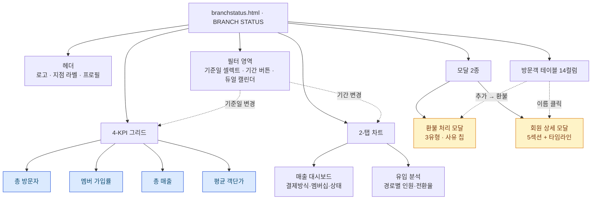
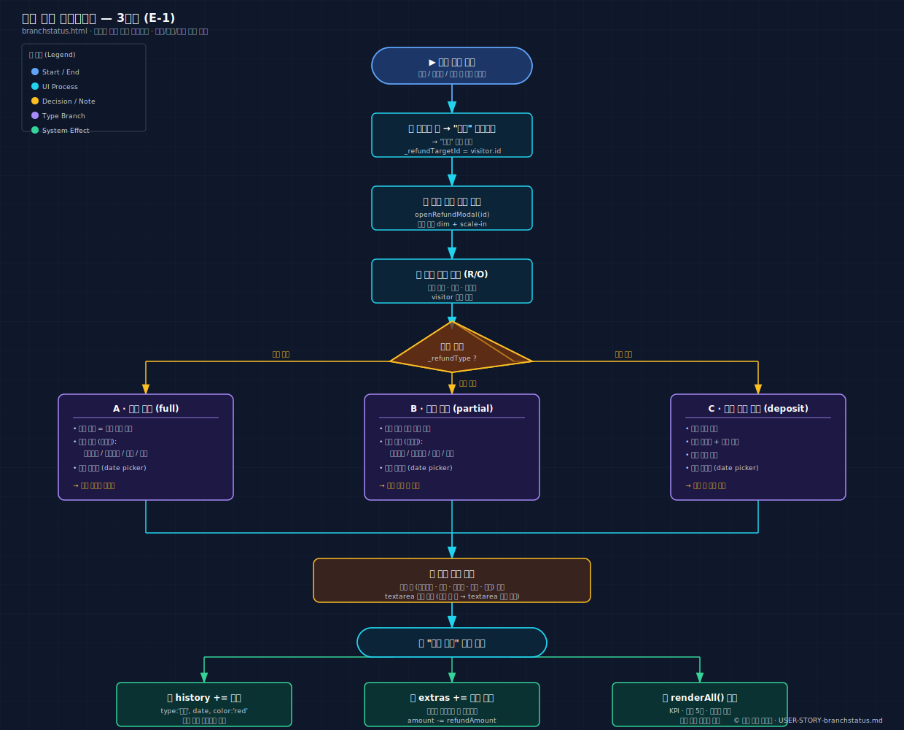
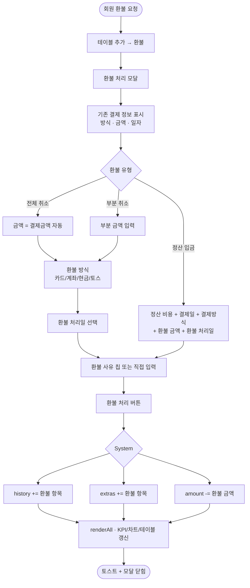
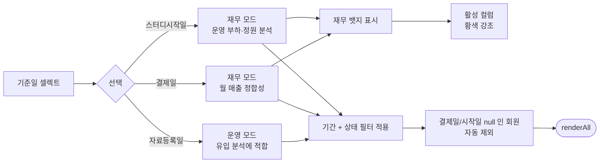
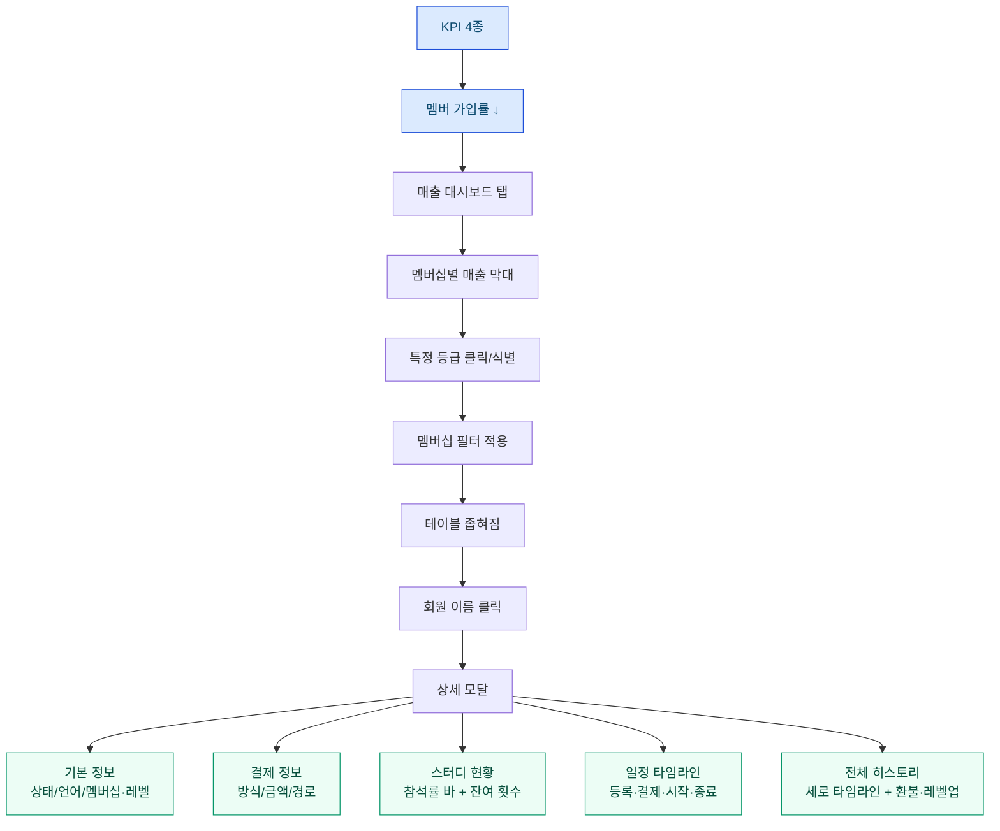
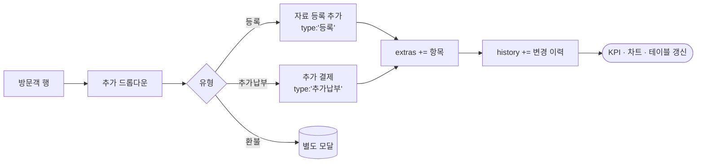
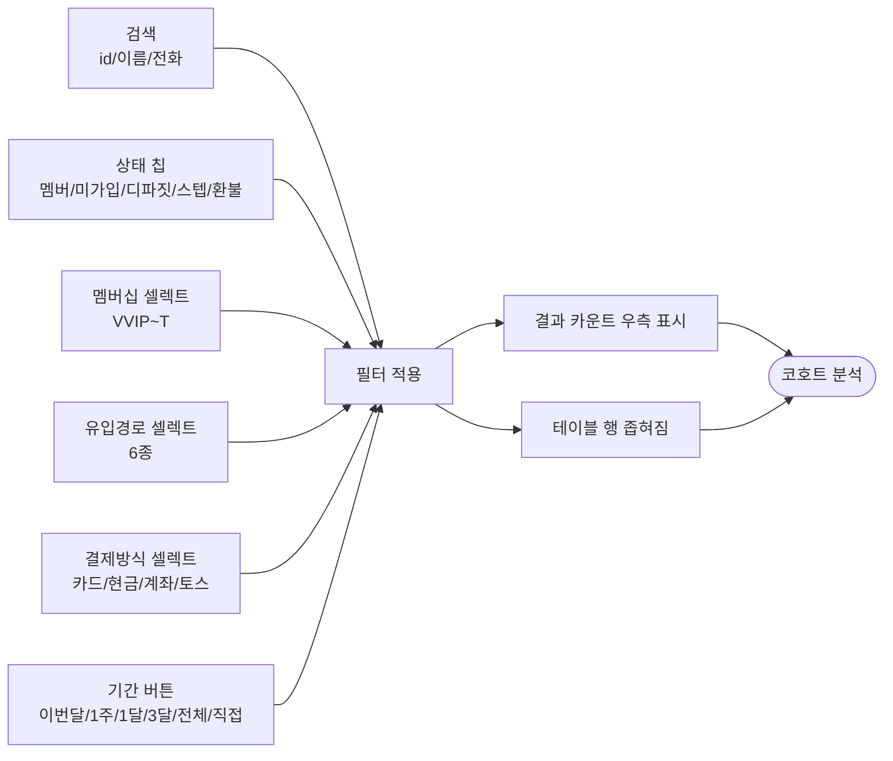
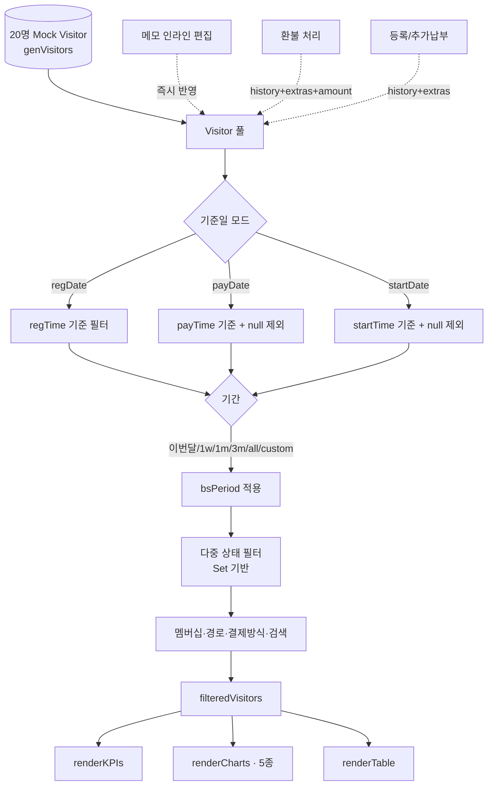

# USER STORY: 지점 회원·매출 현황 — branchstatus.html

> 페이지별 핵심 유저 스토리 + 시각적 표현
> **연관 문서:** [USER-STORY-call.md](./USER-STORY-call.md) (회신→등록 흐름의 다음 단계) · [USER-STORY-stats.md](./USER-STORY-stats.md) (지점 전사 통계)

---

## 한 줄 요약

> **기준일(자료등록·결제·스터디시작)을 토글해 가며 지점의 방문객·매출·전환·환불을 한 화면에서 풀어내는 회계 친화 대시보드.**

| 항목 | 내용 |
|------|------|
| 주요 Actor | **지점장** (메인) · **매니저** (서브) |
| 진입 경로 | 햄버거 메뉴 → "Branch Status" |
| 핵심 가치 | "기준일 토글로 재무 모드" → "환불 3유형 안전 처리" → "필터 다중조합 코호트" |

---

## 핵심 가치 카드 (3-Up)

```
┌──────────────────────┬──────────────────────┬──────────────────────┐
│  📅 기준일 토글       │  💸 환불 3유형        │  🔍 다중 필터 코호트  │
├──────────────────────┼──────────────────────┼──────────────────────┤
│ 자료등록일 / 결제일 / │ 전체 취소 · 부분 취소 │ 상태·멤버십·경로·    │
│ 스터디시작일 토글로   │ · 환불 정산 입금을    │ 결제방식·기간을      │
│ 동일 데이터를 운영    │ 사유 칩 + 자유 입력   │ 다중 조합해 특정     │
│ /재무 두 시점에서.    │ 으로 안전 처리.       │ 코호트만 좁히기.     │
└──────────────────────┴──────────────────────┴──────────────────────┘
```

---

## 페이지 컴포넌트 구조도



---

## 핵심 유저 스토리 (5)

### 🟥 P0 · E-1 환불 처리 (3유형) (Hero) ⭐

> **"환불 요청이 들어왔을 때, 결제 정보를 보면서 전체/부분/정산 중 맞는 유형을 골라 사유까지 한 번에 닫고 싶다."**

| 항목 | 내용 |
|------|------|
| Actor | 지점장 |
| 트리거 | 테이블 행 → "추가" 드롭다운 → "환불" |
| 완료 조건 | history·extras 기록 + amount 반영 + 토스트 |

**🎨 baoyu-diagram SVG (다크 테마):**



**📐 Mermaid (라이트 테마, 인라인):**



---

### 🟥 P0 · E-2 기준일 전환으로 재무 모드 분석

> **"같은 회원 데이터라도 결제일 기준으로 보면 이번 달 매출, 시작일 기준으로 보면 운영 부하가 다르게 보인다."**

| 항목 | 내용 |
|------|------|
| Actor | 지점장 |
| 트리거 | 상단 "기준일" 셀렉트 변경 |
| 완료 조건 | KPI·차트·테이블 모두 새 기준일로 리렌더 |



---

### 🟧 P1 · E-3 KPI → 차트 → 테이블 → 상세 모달 드릴다운

> **"가입률이 떨어진 게 어느 멤버십 등급 때문인지, 그 등급의 누가 환불했는지까지 따라가고 싶다."**

| 항목 | 내용 |
|------|------|
| Actor | 지점장 |
| 트리거 | KPI 카드 → 탭 차트 → 테이블 행 |
| 완료 조건 | 회원 한 명의 전체 히스토리 타임라인 파악 |



---

### 🟧 P1 · E-4 추가 항목 기록 (등록 / 추가납부)

> **"이미 등록된 회원이 추가 결제하거나 정산 비용을 받았을 때, 한 줄짜리 항목으로 깔끔히 남기고 싶다."**

| 항목 | 내용 |
|------|------|
| Actor | 매니저 |
| 트리거 | 테이블 행 → "추가" 드롭다운 → "등록 / 추가납부" |
| 완료 조건 | extras 배열 누적 + amount 반영 + 차트 갱신 |



---

### 🟦 P2 · E-5 다중 필터로 특정 코호트 좁히기

> **"이번 달 카카오로 들어와서 카드로 결제한 VVIP만 따로 보고 싶다."**

| 항목 | 내용 |
|------|------|
| Actor | 지점장 |
| 트리거 | 테이블 상단 필터 영역 |
| 완료 조건 | 결과 카운트 우측 갱신 + 행 좁혀짐 |



---

## 데이터 흐름 다이어그램



---

## 컬러 팔레트 빠른참조

### 회원 상태 (4종 + 환불 뱃지)

| 상태 | 의미 | 색상 |
|------|------|------|
| 멤버 | 정식 가입 | 🟢 emerald `#10b981` |
| 미가입 | 자료 등록만 | ⚪ slate `#94a3b8` |
| 디파짓 | 선예약·계약금 | 🟠 amber `#f59e0b` |
| 스텝 | 진행 중 단계 | 🟣 purple `#8b5cf6` |
| 환불 (뱃지) | history 환불 기록 | 🔴 red `#ef4444` |

### 멤버십 등급 (5종, T = CLAUDE.md의 'B'에 대응)

| 등급 | 총 세션 | 정가 | 비고 |
|------|--------|------|------|
| VVIP | 1,040회 | 3,200,000원 | 최상위 |
| VIP | 520회 | 1,800,000원 | 고관여 |
| A+ | 104회 | 480,000원 | 표준 |
| H+ | 52회 | 260,000원 | 입문 |
| **T** | 24회 | 130,000원 | (= CLAUDE.md의 'B' 등급) |

> ⚠️ branchstatus.html 코드는 'T'로 표기, 글로벌 CLAUDE.md는 'B'로 표기. 의미는 동일 (24회 입문 등급). 향후 통일 권장.

### 유입경로 색상 (6종)

| 경로 | 헥스 |
|------|------|
| 카카오 | `#FBBF24` |
| 네이버 | `#22C55E` |
| 인스타 | `#D946EF` |
| 지인소개 | `#94A3B8` |
| 워크인 | `#F97316` |
| 전화문의 | `#6366F1` |

### 환불 유형 (3종)

| 유형 | 입력 필드 | 사용 시점 |
|------|----------|----------|
| 전체 취소 (full) | 환불 방식 + 처리일 | 결제 직후 전액 환불 |
| 부분 취소 (partial) | 부분 금액 + 방식 + 처리일 | 일부 차감 후 환불 |
| 환불 정산 입금 (deposit) | 정산 비용/결제일/결제방식 + 환불 금액/처리일 | 정산 후 잔액 환불 |

---

## 관련 페이지 링크

- 🔗 [USER-STORY-home.md](./USER-STORY-home.md) — 대시보드 캘린더 (홈)
- 🔗 [USER-STORY-leader.md](./USER-STORY-leader.md) — 리더 팀 출석부
- 🔗 [USER-STORY-member.md](./USER-STORY-member.md) — 멤버 팀 출석부
- 🔗 [USER-STORY-call.md](./USER-STORY-call.md) — 신규 회신 (이전 단계: 회신 → 예약 → 등록)
- 🔗 [USER-STORY-stats.md](./USER-STORY-stats.md) — 지점 전사 KPI 통계
- 🔗 [diagrams/README.md](./diagrams/README.md) — baoyu-diagram SVG 색인
