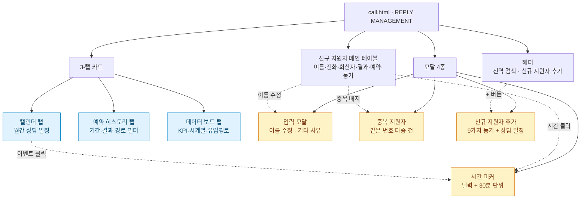
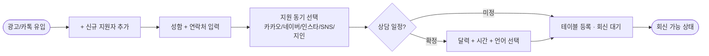
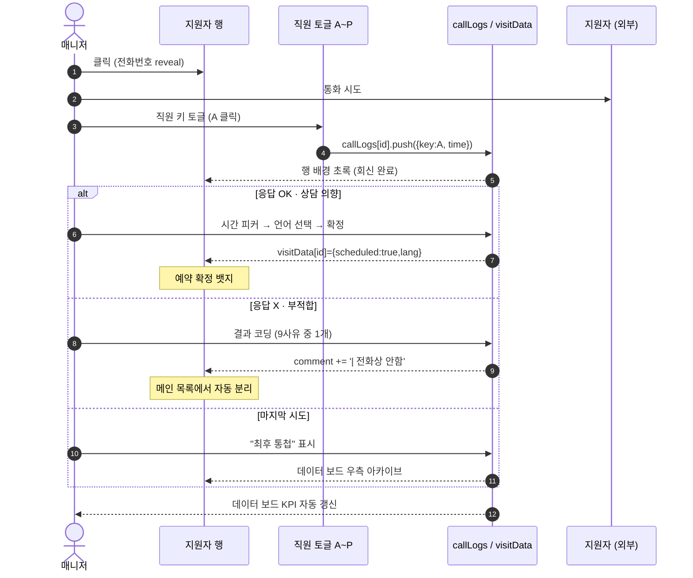
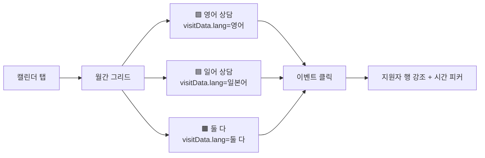
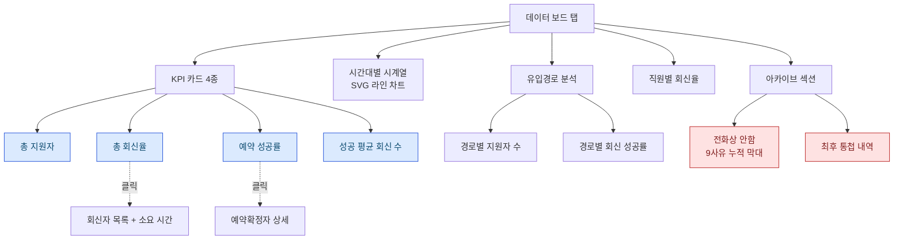
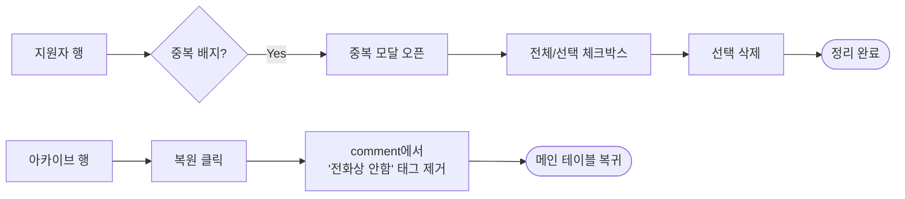
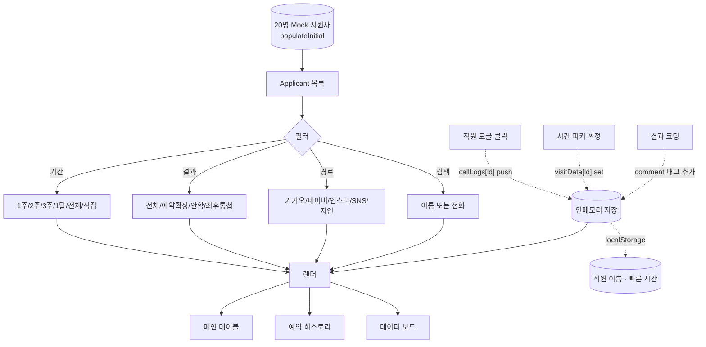

# USER STORY: 신규 회신 통합 관리 — call.html

> 페이지별 핵심 유저 스토리 + 시각적 표현
> **연관 문서:** [USER-STORY-home.md](./USER-STORY-home.md) · [USER-STORY-branchstatus.md](./USER-STORY-branchstatus.md)

---

## 한 줄 요약

> **신규 지원자 한 명 한 명에 대한 통화 기록·결과 코딩·예약 확정·분석을 한 화면에서 처리하는 통합 콜백 워크벤치.**

| 항목 | 내용 |
|------|------|
| 주요 Actor | **매니저** (메인) · **지점장** (분석/감독) |
| 진입 경로 | 햄버거 메뉴 → "신규 회신" |
| 핵심 가치 | "콜 한 통=한 클릭" → "결과 자동 아카이브" → "데이터로 회신 효율 추적" |

---

## 핵심 가치 카드 (3-Up)

```
┌──────────────────────┬──────────────────────┬──────────────────────┐
│  📞 한 클릭 콜로그    │  🗂️ 자동 아카이브    │  📊 데이터 보드 분석  │
├──────────────────────┼──────────────────────┼──────────────────────┤
│ 직원 A~P 토글로       │ "전화상 안함" 9사유  │ 회신율·전환율·       │
│ 통화 기록 한 번 클릭, │ 또는 "최후 통첩"     │ 시간대 분포·유입경로 │
│ 전화번호 자동 공개,   │ 선택 시 메인 목록    │ 직원별 성과 KPI를    │
│ 행 색상 즉시 갱신.    │ 에서 자동 분리.      │ 한 탭에서.            │
└──────────────────────┴──────────────────────┴──────────────────────┘
```

---

## 페이지 컴포넌트 구조도



---

## 핵심 유저 스토리 (5)

### 🟥 P0 · D-1 신규 지원자 등록 + 빠른 회신

> **"광고 보고 막 들어온 지원자를 1초 안에 시스템에 넣고 통화 가능 상태로 만들고 싶다."**

| 항목 | 내용 |
|------|------|
| Actor | 매니저 |
| 트리거 | 헤더 "+ 신규 지원자 추가" 버튼 |
| 완료 조건 | 메인 테이블 최상단에 신규 행 노출 + 통화 가능 상태 |



---

### 🟥 P0 · D-2 콜백 → 결과 코딩 → 예약 확정 (Hero) ⭐

> **"전화 한 통 돌리고, 결과를 한 클릭으로 분류하고, 예약이 잡히면 그 자리에서 일정까지 닫고 싶다."**

| 항목 | 내용 |
|------|------|
| Actor | 매니저 |
| 트리거 | 메인 테이블 행 클릭 (전화번호 reveal) |
| 완료 조건 | callLogs 누적 + 예약 확정 또는 자동 아카이브 |

**🎨 baoyu-diagram SVG (다크 테마):**


**📐 Mermaid (라이트 테마, 인라인):**



---

### 🟧 P1 · D-3 캘린더에서 상담 일정 한눈에 보기

> **"이번 달 어떤 날에 누구와 상담이 잡혀 있는지 색깔로 빠르게 훑고 싶다."**

| 항목 | 내용 |
|------|------|
| Actor | 지점장 / 매니저 |
| 트리거 | 탭 카드 → "캘린더" 탭 |
| 완료 조건 | 월간 상담 분포 파악, 빈 슬롯 식별 |



---

### 🟧 P1 · D-4 데이터 보드로 회신율·전환율 분석

> **"이번 주 회신율은 얼마였고, 어느 유입경로가 예약까지 가장 잘 가는지 데이터로 보고 싶다."**

| 항목 | 내용 |
|------|------|
| Actor | 지점장 |
| 트리거 | 탭 카드 → "데이터 보드" 탭 |
| 완료 조건 | KPI·시계열·유입경로별 전환 파악 |



---

### 🟦 P2 · D-5 중복 지원자 정리 + 아카이브 복원

> **"같은 번호로 두세 번 지원한 건을 정리하고, 잘못 아카이브한 건은 복원하고 싶다."**

| 항목 | 내용 |
|------|------|
| Actor | 매니저 |
| 트리거 | 행의 "중복" 배지 클릭 또는 아카이브 행의 "복원" |
| 완료 조건 | 중복 정리 또는 메인 테이블 복귀 |



---

## 데이터 흐름 다이어그램



---

## 컬러 팔레트 빠른참조

### 유입경로 색상 (5종)

| 경로 | 색상 | 헥스 |
|------|------|------|
| 카카오 | 🟡 노랑 | `#FBBF24` |
| 네이버 | 🟢 초록 | `#22C55E` |
| 인스타 | 🟣 마젠타 | `#D946EF` |
| SNS광고 | 🔵 파랑 | `#3B82F6` |
| 지인소개 | ⚪ 슬레이트 | `#94A3B8` |

### 회신 결과 코딩 (9종 + 1)

| 분류 | 의미 |
|------|------|
| 없는 번호 | 결번 / 사용 불가 |
| 타지역 거주 | 지점 권역 외 |
| 잘못누름·관심없음·바로끊음 | 의사 없음 |
| 직접 콜탁 희망 (고민) | 보류 |
| 당분간 참여 어려움 | 시기 미스 |
| 미성년자 | 자격 미달 |
| 기존 멤버 | 중복 |
| 나이 (80대 이상) | 자격 미달 |
| 기타 | 입력 모달로 직접 사유 |
| 최후 통첩 | 별도 아카이브 |

### 행 상태 시각

| 조건 | 시각 |
|------|------|
| `callLogs[id]` 비어 있음 | 기본 (회색) |
| `callLogs[id]` 1개 이상 | 행 배경 초록 |
| `visitData[id].scheduled=true` | "예약 확정" 뱃지 |
| `comment.includes('전화상 안함')` | 메인 목록 제외 → 데이터 보드 아카이브 |
| `comment.includes('최후 통첩')` | 데이터 보드 우측 별도 영역 |

---

## 관련 페이지 링크

- 🔗 [USER-STORY-home.md](./USER-STORY-home.md) — 대시보드 캘린더 (홈)
- 🔗 [USER-STORY-leader.md](./USER-STORY-leader.md) — 리더 팀 출석부
- 🔗 [USER-STORY-member.md](./USER-STORY-member.md) — 멤버 팀 출석부
- 🔗 [USER-STORY-branchstatus.md](./USER-STORY-branchstatus.md) — 회원/매출 현황 (다음 단계: 회신 → 등록 → 멤버십 분석)
- 🔗 [USER-STORY-stats.md](./USER-STORY-stats.md) — 월간 통계 (지점 전사 KPI)
- 🔗 [diagrams/README.md](./diagrams/README.md) — baoyu-diagram SVG 색인
