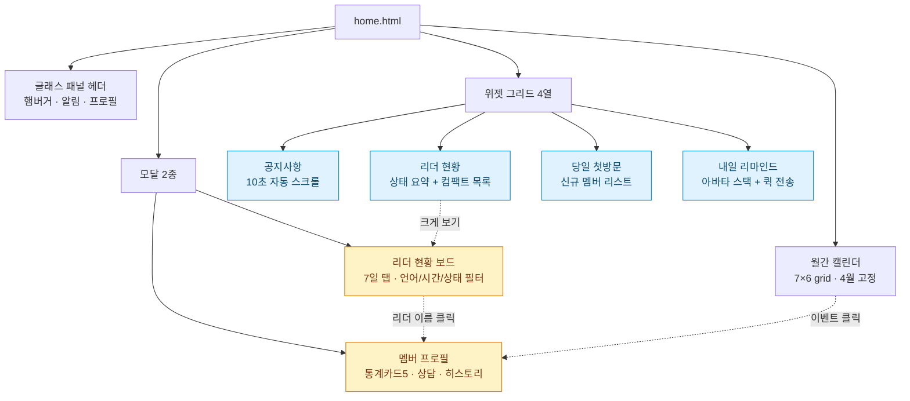
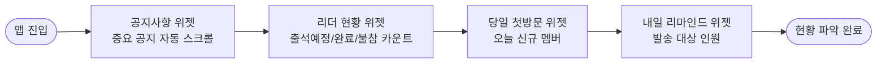
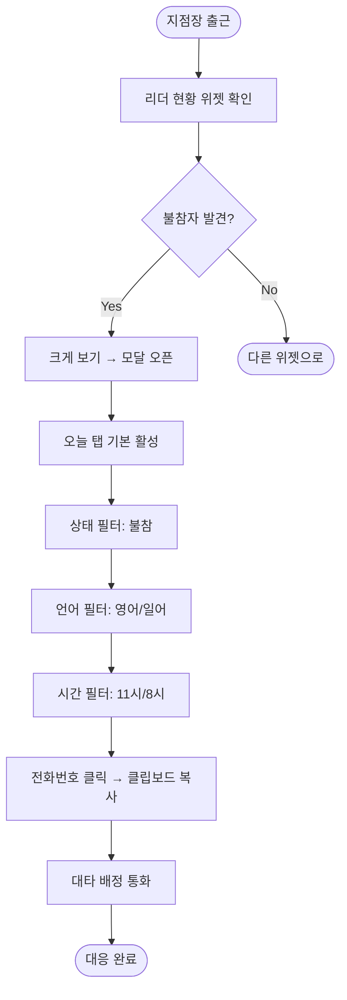
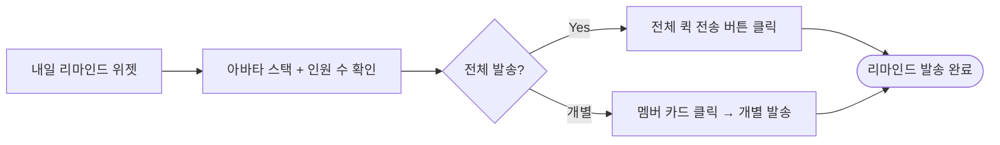
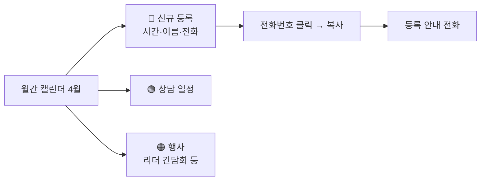
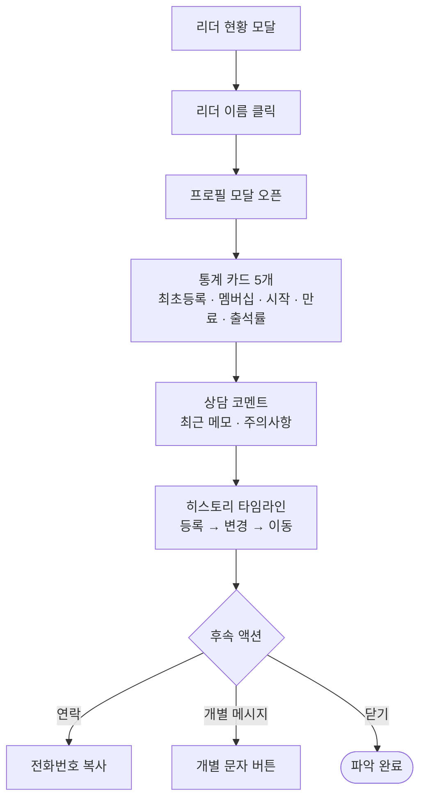
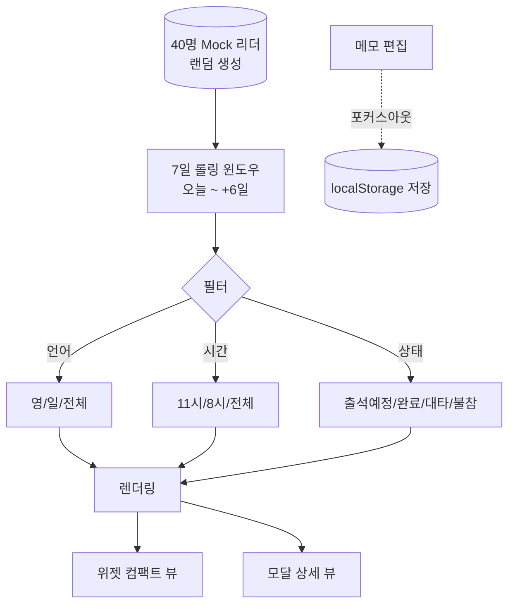

# USER STORY: 대시보드 캘린더 (홈) — home.html

> 페이지별 핵심 유저 스토리 + 시각적 표현
> **연관 문서:** [PRD-home.md](./PRD-home.md) · [USER-SCENARIOS.md (A 카테고리)](./USER-SCENARIOS.md#a-대시보드-homehtml)

---

## 한 줄 요약

> **지점장이 출근 직후 1분 안에 오늘의 리더·신규멤버·일정을 파악하고, 원클릭으로 후속 액션을 트리거하는 통합 현황판.**

| 항목 | 내용 |
|------|------|
| 주요 Actor | **지점장** (메인) · **매니저** (서브) |
| 진입 경로 | 앱 최초 진입 시 기본 페이지 |
| 핵심 가치 | "1분 현황 파악" → "원클릭 대응" → "월간 한눈에" |

---

## 핵심 가치 카드 (3-Up)

```
┌──────────────────────┬──────────────────────┬──────────────────────┐
│  ⚡ 1분 현황 파악      │  🎯 원클릭 대응       │  📅 월간 한눈에        │
├──────────────────────┼──────────────────────┼──────────────────────┤
│ 위젯 4개로 오늘의      │ 전화번호 복사,        │ 신규등록(파)·         │
│ 공지·리더·신규멤버·    │ 리마인드 일괄 발송,    │ 상담(초)·행사(주)     │
│ 리마인드를 즉시 확인.  │ 메모 인라인 편집.      │ 색상 코드로 분리.     │
└──────────────────────┴──────────────────────┴──────────────────────┘
```

---

## 페이지 컴포넌트 구조도



---

## 핵심 유저 스토리 (5)

### 🟥 P0 · A-1 출근 후 오늘 현황 파악

> **"출근하자마자 오늘 하루를 1분 안에 그림으로 잡고 싶다."**

| 항목 | 내용 |
|------|------|
| Actor | 지점장 |
| 트리거 | 앱 진입 (자동) |
| 완료 조건 | 1분 내 리더·신규·공지 파악 완료 |



> 📖 상세 단계: [USER-SCENARIOS.md#a-1](./USER-SCENARIOS.md#a-1-출근-후-오늘-현황-파악)

---

### 🟧 P1 · A-2 리더 현황 상세 확인 (7일)

> **"이번 주 어떤 리더가 불참인지, 누구에게 대타 요청할지 파악하고 싶다."**

| 항목 | 내용 |
|------|------|
| Actor | 지점장 |
| 트리거 | 리더 현황 위젯 → "크게 보기" |
| 완료 조건 | 불참 리더 식별 + 연락처 확보 |

**🎨 baoyu-diagram SVG (다크 테마):**


**📐 Mermaid (라이트 테마, 인라인):**



> 📖 상세 단계: [USER-SCENARIOS.md#a-2](./USER-SCENARIOS.md#a-2-리더-현황-상세-확인-7일)

---

### 🟦 P2 · A-3 신규 멤버 리마인드 전송

> **"내일 첫 방문할 신규 멤버에게 리마인드 메시지를 한 번에 보내고 싶다."**

| 항목 | 내용 |
|------|------|
| Actor | 매니저 |
| 트리거 | "내일 리마인드" 위젯의 "전체 퀵 전송" 버튼 |
| 완료 조건 | 대상 전원 발송 완료 |



> 📖 상세 단계: [USER-SCENARIOS.md#a-3](./USER-SCENARIOS.md#a-3-신규-멤버-리마인드-전송)

---

### 🟦 P2 · A-4 캘린더 월간 일정 확인

> **"이번 달 신규등록·상담·행사 일정을 색깔로 한눈에 보고 싶다."**

| 항목 | 내용 |
|------|------|
| Actor | 지점장 |
| 트리거 | 페이지 스크롤 |
| 완료 조건 | 월간 주요 일정 색상별 파악 |



> 📖 상세 단계: [USER-SCENARIOS.md#a-4](./USER-SCENARIOS.md#a-4-캘린더에서-월간-일정-확인)

---

### 🟥 P0 · A-5 특정 멤버/리더 프로필 확인

> **"리더 한 명의 등록 이력·상담·출석률을 종합해서 보고 싶다."**

| 항목 | 내용 |
|------|------|
| Actor | 지점장 |
| 트리거 | 리더 현황 모달 또는 캘린더 이벤트의 이름 클릭 |
| 완료 조건 | 멤버 맥락(등록·멤버십·출석·상담) 파악 |



> 📖 상세 단계: [USER-SCENARIOS.md#a-5](./USER-SCENARIOS.md#a-5-특정-멤버-프로필-확인)

---

## 데이터 흐름 다이어그램



---

## 컬러 팔레트 빠른참조

### 캘린더 이벤트 색상

| 색상 | 의미 | Tailwind |
|------|------|---------|
| 🔵 파랑 | 신규 등록 | `bg-blue-100 text-blue-700` |
| 🟢 초록 | 상담 일정 | `bg-emerald-100 text-emerald-700` |
| 🟠 주황 | 행사 (간담회·회식) | `bg-orange-100 text-orange-700` |

### 멤버십 등급 (5단계, 행 배경색)

| 등급 | 총 세션 | Tailwind |
|------|---------|----------|
| **VVIP** | 1,040회 | `bg-purple-50` |
| **VIP** | 520회 | `bg-indigo-50` |
| **A+** | 104회 | `bg-emerald-50` |
| **H+** | 52회 | `bg-orange-50` |
| **B** | 24회 | `bg-slate-50` |

### 출석 상태 (5종)

| 상태 | 색상 | 의미 |
|------|------|------|
| 출석예정 | 회색 | 기본 |
| 출석완료 | 초록 | 금일출석 클릭 후 |
| 대타예정 | 주황 | 대타 배정됨 |
| 대타출석완료 | 주황+체크 | 대타 도착 |
| 불참 | 빨강 | 사전 통보됨 |

---

## 관련 페이지 링크

- 🔗 [PRD-home.md](./PRD-home.md) — 기능 명세 (위젯·캘린더·모달 상세)
- 🔗 [USER-SCENARIOS.md](./USER-SCENARIOS.md) — 시나리오 단계별 행동
- 🔗 [USER-STORY-leader.md](./USER-STORY-leader.md) — 리더 팀 페이지 (햄버거 → "리더 팀")
- 🔗 [USER-STORY-member.md](./USER-STORY-member.md) — 멤버 팀 페이지 (햄버거 → "멤버 팀")
