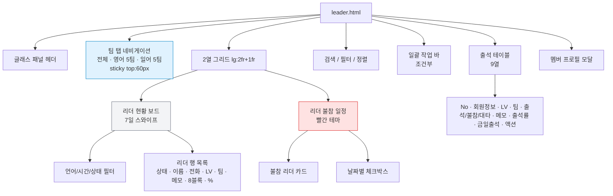
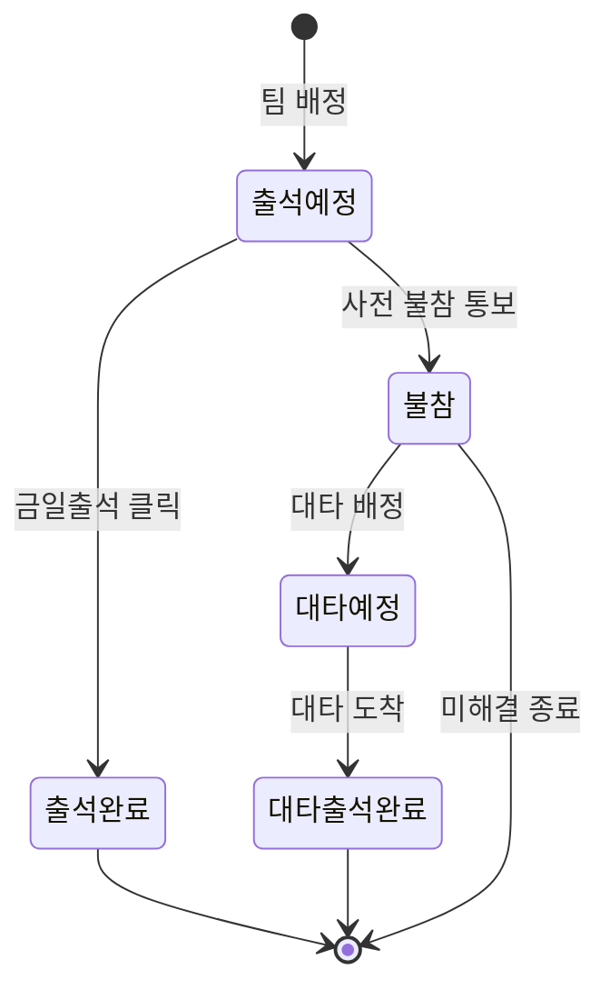
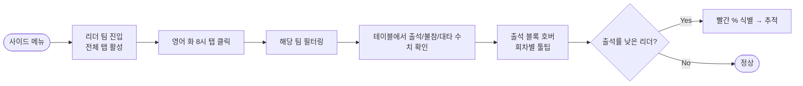
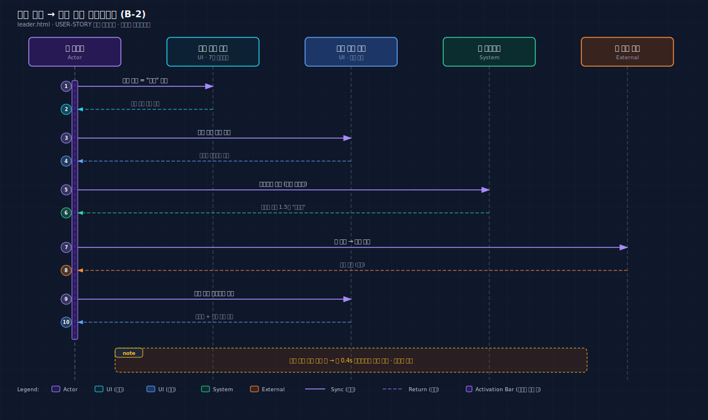
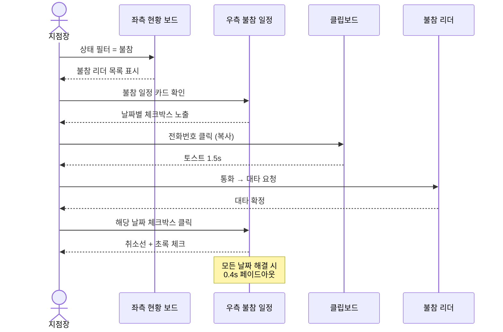
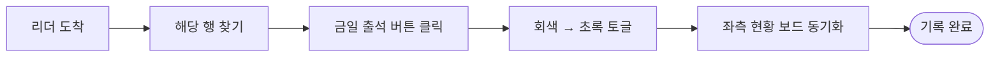
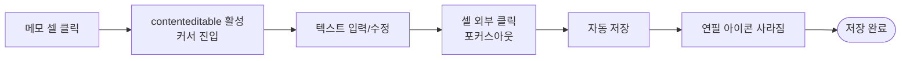
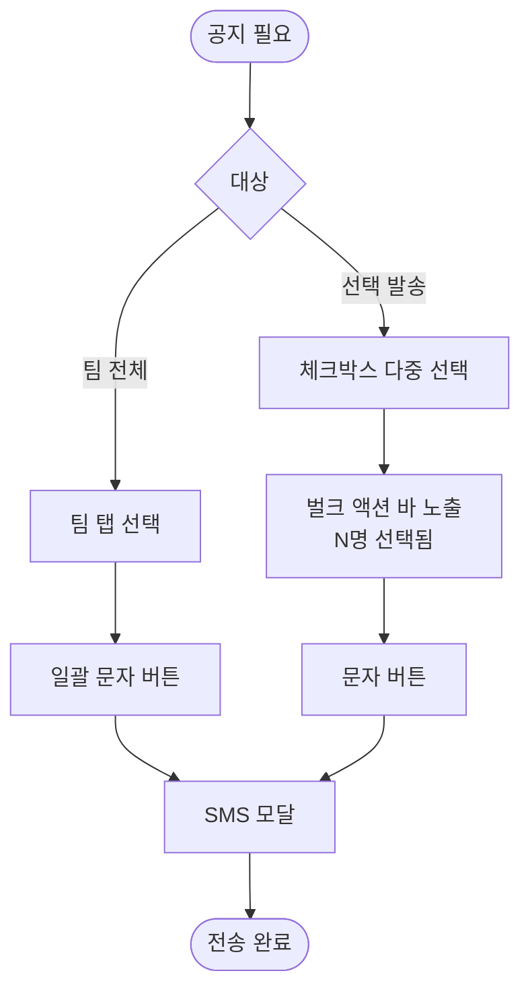

# USER STORY: 리더 팀 출석부 — leader.html

> 페이지별 핵심 유저 스토리 + 시각적 표현
> **연관 문서:** [PRD-leader.md](./PRD-leader.md) · [USER-SCENARIOS.md (B 카테고리)](./USER-SCENARIOS.md#b-리더-팀-leaderhtml)

---

## 한 줄 요약

> **60명 리더의 팀별/날짜별 출석을 한 화면에서 추적하고, 불참 → 대타 워크플로우를 클릭 몇 번에 마무리하는 출석부.**

| 항목 | 내용 |
|------|------|
| 주요 Actor | **지점장** (대응) · **매니저** (체크) |
| 진입 경로 | 사이드 메뉴 → "리더 팀" |
| 핵심 가치 | "팀별 출석 한눈에" → "불참→대타 워크플로우" → "인라인 메모 즉시 저장" |

---

## 핵심 가치 카드 (3-Up)

```
┌──────────────────────┬──────────────────────┬──────────────────────┐
│  📋 팀별 한눈에        │  🔁 불참→대타         │  ✏️ 인라인 메모        │
├──────────────────────┼──────────────────────┼──────────────────────┤
│ 영어/일어 × 요일 ×    │ 좌측 현황 보드 +      │ 메모 셀 클릭 즉시      │
│ 시간 탭으로 팀 단위    │ 우측 불참 일정으로    │ 편집, 포커스아웃       │
│ 출석부 전환.          │ 1-2클릭에 처리.       │ 자동 저장.            │
└──────────────────────┴──────────────────────┴──────────────────────┘
```

---

## 페이지 레이아웃 구조도



---

## 출석 상태 전이도



---

## 핵심 유저 스토리 (5)

### 🟥 P0 · B-1 특정 팀 리더 출석부 확인

> **"영어 화 8시 팀의 리더가 누가 안 나오고 있는지 보고 싶다."**

| 항목 | 내용 |
|------|------|
| Actor | 지점장 |
| 트리거 | 사이드 메뉴 → "리더 팀" → 팀 탭 클릭 |
| 완료 조건 | 출석률 낮은 리더 식별 |



> 📖 상세 단계: [USER-SCENARIOS.md#b-1](./USER-SCENARIOS.md#b-1-특정-팀-리더-출석부-확인)

---

### 🟧 P1 · B-2 불참 리더 대응 및 대타 관리 ⭐

> **"불참 통보 받은 리더의 일정을 확인하고, 대타를 배정해서 빨리 정리하고 싶다."** — 페이지 핵심 워크플로우

| 항목 | 내용 |
|------|------|
| Actor | 지점장 |
| 트리거 | 좌측 보드 "불참" 필터 / 우측 불참 일정 보드 |
| 완료 조건 | 모든 불참 날짜에 대타 배정 또는 해결 처리 |

**🎨 baoyu-diagram SVG (다크 테마):**



**📐 Mermaid (라이트 테마, 인라인):**



> 📖 상세 단계: [USER-SCENARIOS.md#b-2](./USER-SCENARIOS.md#b-2-불참-리더-대응-및-대타-관리)

---

### 🟥 P0 · B-4 리더 당일 출석 체크

> **"리더가 도착하면 한 클릭으로 출석 기록한다."**

| 항목 | 내용 |
|------|------|
| Actor | 매니저 |
| 트리거 | 출석 테이블 행의 "금일 출석" 셀 클릭 |
| 완료 조건 | 회색 → 초록 체크 + 좌측 보드 동기화 |



> 📖 상세 단계: [USER-SCENARIOS.md#b-4](./USER-SCENARIOS.md#b-4-리더-당일-출석-체크)

---

### 🟧 P1 · B-5 리더 메모 수정

> **"이 리더는 다음 주에 휴가 — 짧게 메모 남기고 끝내고 싶다."**

| 항목 | 내용 |
|------|------|
| Actor | 지점장 |
| 트리거 | 메모 셀 클릭 |
| 완료 조건 | 포커스아웃 시 자동 저장 |



> 📖 상세 단계: [USER-SCENARIOS.md#b-5](./USER-SCENARIOS.md#b-5-리더-메모-수정)

---

### 🟦 P2 · B-6 리더 일괄 문자 전송

> **"이번 주 토요일 휴강 공지를 영어 토 11시 팀 리더 전체에게 보낸다."**

| 항목 | 내용 |
|------|------|
| Actor | 지점장 |
| 트리거 | 팀 탭 선택 후 "일괄 문자" 또는 체크박스 → 벌크 액션 바 |
| 완료 조건 | 대상 리더에게 SMS 발송 |



> 📖 상세 단계: [USER-SCENARIOS.md#b-6](./USER-SCENARIOS.md#b-6-리더에게-일괄-문자-전송)

---

## 컬러 팔레트 빠른참조

### 리딩 레벨 색상

| 레벨 | 색상 | Tailwind |
|------|------|----------|
| **LV0** | 슬레이트 | `bg-slate-500` |
| **LV1** | 에메랄드 | `bg-emerald-500` |
| **LV2** | 블루 | `bg-blue-500` |
| **LV3** | 퍼플 | `bg-purple-500` |
| **LV4** | 앰버 | `bg-amber-500` |

### 팀 색상

| 언어 | 색상 | HEX |
|------|------|-----|
| **영어** | 보라 | `#9B59B6` |
| **일어** | 파랑 | `#007BFF` |

### 출석 상태 색상 (5종)

| 상태 | 배지 색상 |
|------|----------|
| 출석예정 | 슬레이트 |
| 출석완료 | 에메랄드 |
| 대타예정 | 앰버 |
| 대타출석완료 | 앰버 + 체크 |
| 불참 | 레드 |

---

## 페이지 동작 핵심 트리거 요약

| UI 액션 | 결과 | JS 핸들러 |
|---------|------|----------|
| 팀 탭 클릭 | 해당 팀 리더만 필터링 | `data-team` 속성 기반 |
| 날짜 탭 클릭 / 스와이프(50px) | 7일 보드 날짜 전환 | 좌우 스와이프 핸들러 |
| 상태/언어/시간 필터 | 즉시 리더 행 재렌더링 | 멀티 필터 적용 |
| 메모 셀 포커스아웃 | 자동 저장 | contenteditable + blur |
| 출석 블록 호버 | 고정 위치 툴팁 | mouseenter/leave |
| 행 호버 | translateY(-1px) + 그림자 | `.member-row` |
| 불참 체크박스 | 취소선 + 초록 / 모두 해결 시 페이드아웃 | 0.4s transition |

---

## 관련 페이지 링크

- 🔗 [PRD-leader.md](./PRD-leader.md) — 기능 명세 (탭 · 보드 · 테이블 상세)
- 🔗 [USER-SCENARIOS.md](./USER-SCENARIOS.md) — 시나리오 단계별 행동
- 🔗 [USER-STORY-home.md](./USER-STORY-home.md) — 대시보드에서 리더 현황 보기 (A-2)
- 🔗 [USER-STORY-member.md](./USER-STORY-member.md) — 같은 팀의 멤버 출석부 보기 (D-4 교차 시나리오)
