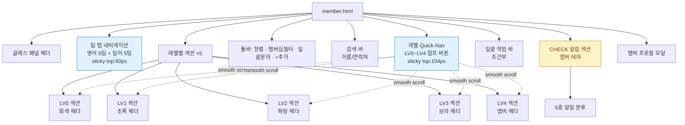
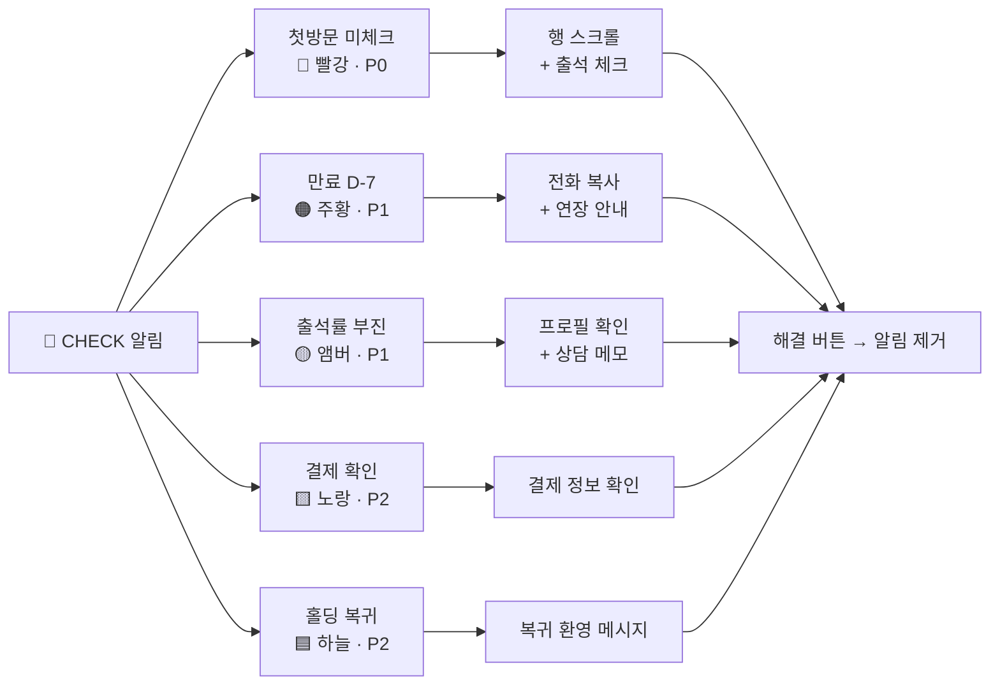
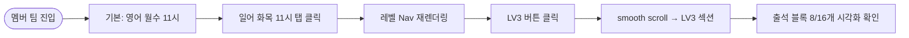
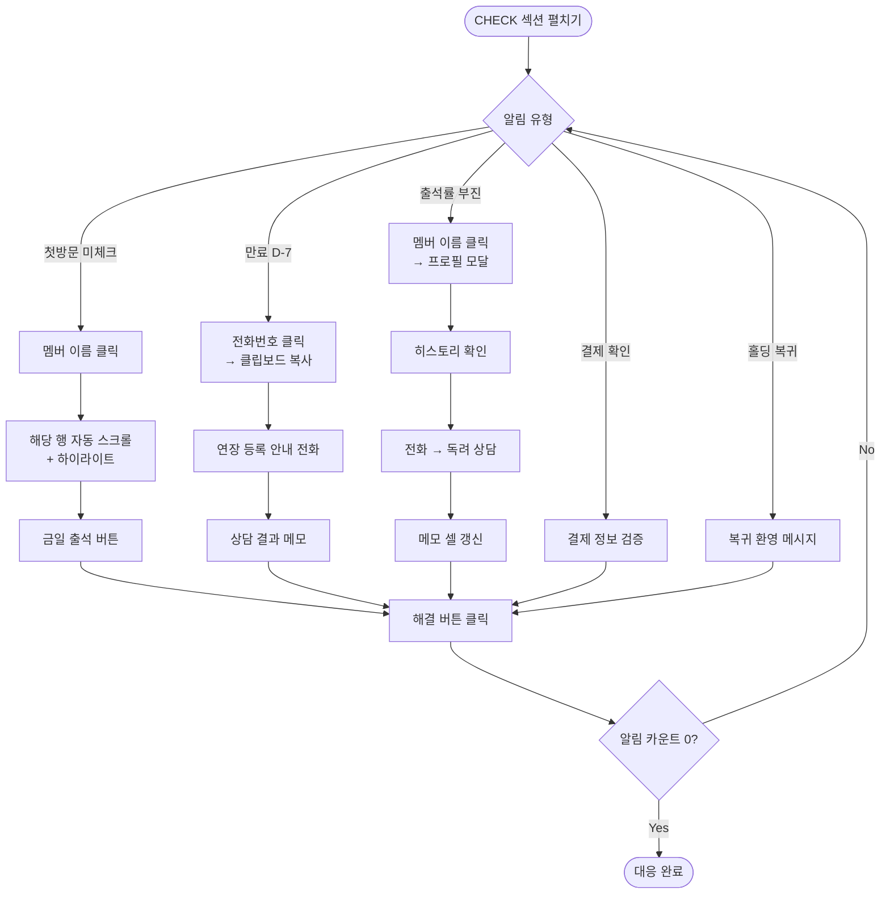
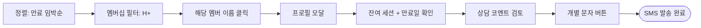
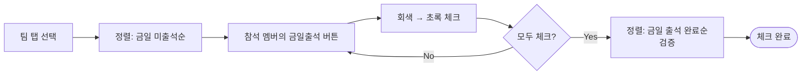
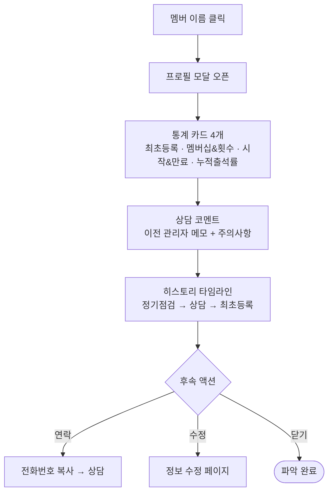
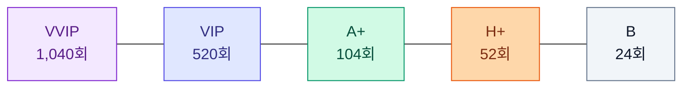
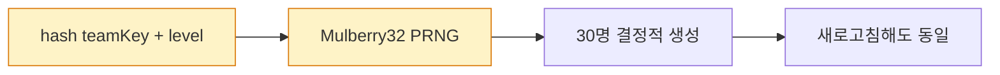

# USER STORY: 멤버 팀 출석부 — member.html

> 페이지별 핵심 유저 스토리 + 시각적 표현
> **연관 문서:** [PRD-member.md](./PRD-member.md) · [USER-SCENARIOS.md (C 카테고리)](./USER-SCENARIOS.md#c-멤버-팀-memberhtml)

---

## 한 줄 요약

> **1,500명 멤버를 팀×레벨 격자로 펼쳐 놓고, CHECK 알림으로 우선순위가 높은 케이스만 골라 즉시 대응하는 출석부.**

| 항목 | 내용 |
|------|------|
| 주요 Actor | **지점장** (대응) · **매니저** (체크) |
| 진입 경로 | 사이드 메뉴 → "멤버 팀" |
| 핵심 가치 | "CHECK 알림 우선 대응" → "레벨별 섹션" → "멤버십 만료 선제 관리" |

---

## 핵심 가치 카드 (3-Up)

```
┌──────────────────────┬──────────────────────┬──────────────────────┐
│  🚨 CHECK 우선 대응    │  🎚 레벨별 섹션       │  ⏳ 만료 선제 관리     │
├──────────────────────┼──────────────────────┼──────────────────────┤
│ 5종 알림으로 첫방문·  │ LV0~LV4 5섹션 +      │ 만료 D-7 알림 +       │
│ 만료·결제·출석부진을  │ Quick-Nav로          │ 멤버십 등급 5단계     │
│ 한 번에 분류·해결.    │ 30명 단위 점프.       │ (VVIP/VIP/A+/H+/B).  │
└──────────────────────┴──────────────────────┴──────────────────────┘
```

---

## 페이지 레이아웃 구조도



---

## CHECK 알림 5종 분류 다이어그램

**🎨 baoyu-diagram SVG (다크 테마, 페이지 핵심 워크플로우 시각화):**


**📐 Mermaid (라이트 테마, 인라인):**



---

## 핵심 유저 스토리 (5)

### 🟥 P0 · C-1 팀별 멤버 출석부 확인

> **"일어 화목 11시 팀의 LV3 멤버 출석 현황을 보고 싶다."**

| 항목 | 내용 |
|------|------|
| Actor | 매니저 |
| 트리거 | 팀 탭 클릭 → 레벨 Quick-Nav |
| 완료 조건 | 특정 레벨 출석 블록 시각화 확인 |



> 📖 상세 단계: [USER-SCENARIOS.md#c-1](./USER-SCENARIOS.md#c-1-팀별-멤버-출석부-확인)

---

### 🟥 P0 · C-2 CHECK 알림 대응 ⭐

> **"오늘 처리해야 할 케이스(첫방문·만료·부진)를 알림 한 곳에서 처리하고 싶다."** — 페이지 핵심 가치

| 항목 | 내용 |
|------|------|
| Actor | 지점장 |
| 트리거 | CHECK 섹션 진입 |
| 완료 조건 | 알림 카운트 0 |



> 📖 상세 단계: [USER-SCENARIOS.md#c-2](./USER-SCENARIOS.md#c-2-주의-알림-check-대응)

---

### 🟧 P1 · C-3 멤버십 만료 임박 관리

> **"H+ 등급 중 만료 임박 멤버를 골라 연장 안내한다."**

| 항목 | 내용 |
|------|------|
| Actor | 지점장 |
| 트리거 | 정렬 변경 + 멤버십 필터 |
| 완료 조건 | 연장 안내 SMS 발송 |



> 📖 상세 단계: [USER-SCENARIOS.md#c-3](./USER-SCENARIOS.md#c-3-멤버십-만료-임박-멤버-관리)

---

### 🟥 P0 · C-5 멤버 당일 출석 일괄 체크

> **"오전 11시 세션이 시작되면 참석한 멤버 30명을 빠르게 체크한다."**

| 항목 | 내용 |
|------|------|
| Actor | 매니저 |
| 트리거 | 팀 탭 선택 + 정렬 변경 |
| 완료 조건 | 참석자 전원 초록 체크 |



> 📖 상세 단계: [USER-SCENARIOS.md#c-5](./USER-SCENARIOS.md#c-5-멤버-당일-출석-일괄-체크)

---

### 🟧 P1 · C-8 멤버 상세 프로필 및 히스토리 확인

> **"상담 전에 이 멤버가 어떤 이력을 거쳤는지 미리 본다."**

| 항목 | 내용 |
|------|------|
| Actor | 지점장 |
| 트리거 | 멤버 이름 클릭 |
| 완료 조건 | 등록·멤버십·출석·상담 맥락 파악 |



> 📖 상세 단계: [USER-SCENARIOS.md#c-8](./USER-SCENARIOS.md#c-8-멤버-상세-프로필-및-히스토리-확인)

---

## 멤버십 등급 비교 차트



| 등급 | 총 세션 | 행 배경색 (Tailwind) | 비고 |
|------|---------|--------------------|------|
| **VVIP** | 1,040회 | `bg-purple-50` | 최상위 |
| **VIP** | 520회 | `bg-indigo-50` | |
| **A+** | 104회 | `bg-emerald-50` | 일반 다수 |
| **H+** | 52회 | `bg-orange-50` | 단기 |
| **B** | 24회 | `bg-slate-50` | 체험 |

---

## 컬러 팔레트 빠른참조

### 리딩 레벨 색상 (5종)

| 레벨 | 색상 | 섹션 헤더 | 인원/팀 |
|------|------|----------|--------|
| **LV0** | 슬레이트 | 회색 바 | 30명 |
| **LV1** | 에메랄드 | 초록 바 | 30명 |
| **LV2** | 블루 | 파랑 바 | 30명 |
| **LV3** | 퍼플 | 보라 바 | 30명 |
| **LV4** | 앰버 | 주황 바 | 30명 |

### CHECK 알림 색상 (5종)

| 알림 | 색상 | Tailwind |
|------|------|----------|
| 첫방문 미체크 | 🔴 빨강 | `bg-red-100` |
| 만료 D-7 | 🟠 주황 | `bg-orange-100` |
| 출석률 부진 | 🟡 앰버 | `bg-amber-100` |
| 결제 확인 | 🟨 노랑 | `bg-yellow-100` |
| 홀딩 복귀 | 🟦 하늘 | `bg-sky-100` |

---

## 데이터 생성 특이사항

> **Seeded PRNG (Mulberry32)** — 새로고침해도 동일한 1,500명 데이터 유지
>
> ```
> hash(teamKey + "_" + level) → 팀+레벨 동일 시 항상 동일한 30명
> ```
> 의도적 설계로, 시연·테스트 시 일관성 보장.



---

## 페이지 동작 핵심 트리거 요약

| UI 액션 | 결과 |
|---------|------|
| 팀 탭 클릭 | 멤버 + 레벨Nav 재렌더링 |
| 레벨 Quick-Nav 클릭 | smooth scroll → 해당 섹션 |
| CHECK 알림 이름 클릭 | 멤버 행 자동 스크롤 + 하이라이트 |
| CHECK "해결" 클릭 | 알림 항목 DOM 제거, 카운트 -1 |
| 금일출석 버튼 클릭 | 회색 ↔ 초록 토글 |
| 메모 셀 포커스아웃 | 자동 저장 |
| 팀 배지 클릭 | 해당 팀 탭으로 자동 전환 |
| 체크박스 다중 선택 | 벌크 액션 바 노출 |

---

## 관련 페이지 링크

- 🔗 [PRD-member.md](./PRD-member.md) — 기능 명세 (CHECK · 레벨섹션 · 멤버십 상세)
- 🔗 [USER-SCENARIOS.md](./USER-SCENARIOS.md) — 시나리오 단계별 행동
- 🔗 [USER-STORY-home.md](./USER-STORY-home.md) — 대시보드에서 신규 멤버 발견 (D-2)
- 🔗 [USER-STORY-leader.md](./USER-STORY-leader.md) — 같은 팀 리더 출석부 보기 (D-4 교차 시나리오)
