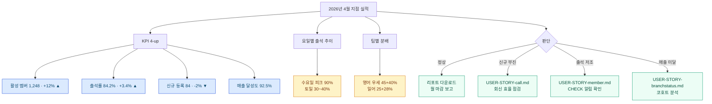
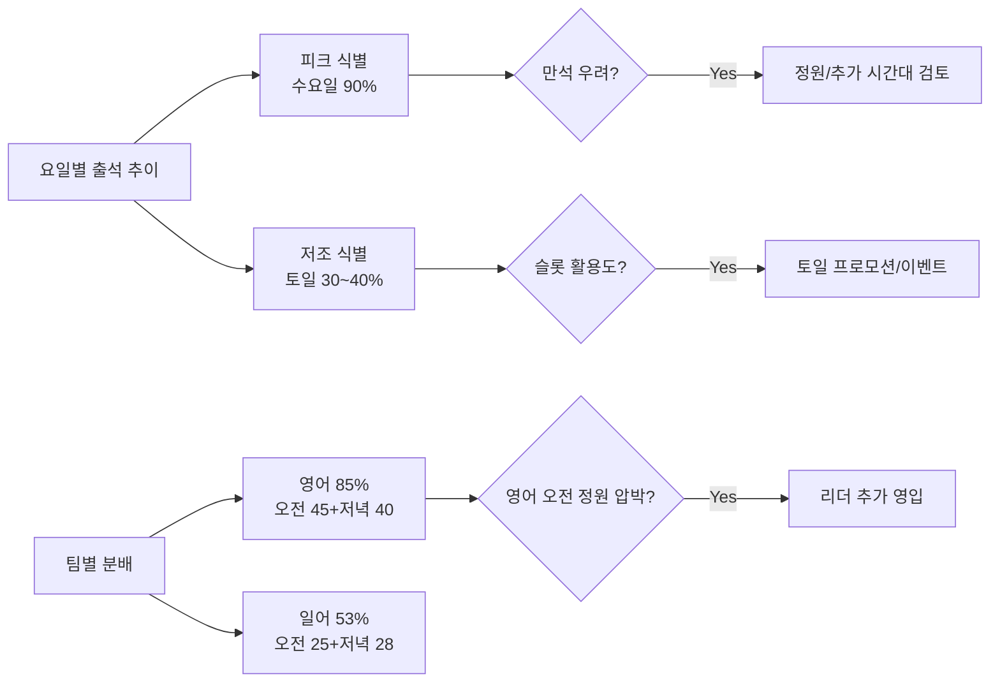
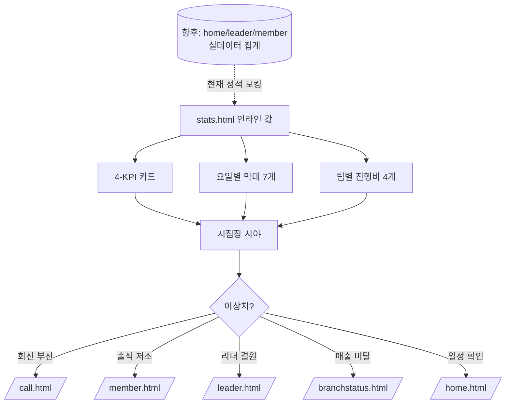

# USER STORY: 지점 통계 & 리포트 — stats.html

> 페이지별 핵심 유저 스토리 + 시각적 표현
> **연관 문서:** [USER-STORY-branchstatus.md](./USER-STORY-branchstatus.md) (회원·매출 상세) · [USER-STORY-home.md](./USER-STORY-home.md) (일별 운영 현황)

---

## 한 줄 요약

> **월간 4개 KPI와 요일·팀 분포 두 차트로 지점장이 1분 안에 "이번 달 잘 돌아가고 있나?"를 판단하는 단일 화면 통계 카드.**

| 항목 | 내용 |
|------|------|
| 주요 Actor | **지점장** (메인) |
| 진입 경로 | 햄버거 메뉴 → "통계 및 리포트" |
| 핵심 가치 | "월간 KPI 4-up" → "요일/팀 분포 한 눈" → "이상치 발견 시 다른 페이지로 드릴다운" |

---

## 핵심 가치 카드 (3-Up)

```
┌──────────────────────┬──────────────────────┬──────────────────────┐
│  📊 월간 KPI 4-up     │  📈 분포 차트 2종     │  🧭 다른 페이지 진입  │
├──────────────────────┼──────────────────────┼──────────────────────┤
│ 활성 멤버 · 출석률 ·  │ 요일별 출석 막대 +   │ 이상치 발견 시       │
│ 신규 등록 · 매출      │ 팀별(영/일·오전/저녁)│ branchstatus / home  │
│ 달성도 — 전월 대비    │ 분배 수평 진행바.    │ / member 등          │
│ ▲▼ 변화율까지.        │ 운영 패턴 한눈에.    │ 후속 페이지로 이동.  │
└──────────────────────┴──────────────────────┴──────────────────────┘
```

---

## 페이지 컴포넌트 구조도

```mermaid
graph TD
    Page[stats.html · STATISTICS]
    Page --> Header[헤더<br/>로고 · 프로필]
    Page --> Action[액션바<br/>월 셀렉트 · 리포트 다운로드]
    Page --> KPI[4-KPI 그리드]
    Page --> Charts[2-차트 그리드]

    KPI --> K1[활성 멤버 1,248명<br/>+12% ▲]
    KPI --> K2[월 평균 출석률 84.2%<br/>+3.4% ▲]
    KPI --> K3[신규 등록 84명<br/>-2% ▼]
    KPI --> K4[매출 달성도 92.5%<br/>진행바]

    Charts --> C1[요일별 출석 추이<br/>월~일 7개 막대]
    Charts --> C2[팀별 분배 현황<br/>영/일 × 오전/저녁]

    C1 -.기간 셀렉트.-> R[최근 4주 / 3개월<br/>(미구현)]
    Action -.달력.-> M[월 선택 모달<br/>(미구현)]
    Action -.다운로드.-> D[PDF/Excel<br/>(미구현)]

    classDef kpi fill:#dbeafe,stroke:#1d4ed8,color:#0c4a6e
    classDef chart fill:#ede9fe,stroke:#7c3aed,color:#4c1d95
    classDef todo fill:#fee2e2,stroke:#b91c1c,color:#7f1d1d,stroke-dasharray:3 3
    class K1,K2,K3,K4 kpi
    class C1,C2 chart
    class R,M,D todo
```

> ⚠️ 점선 테두리(빨강) = 현재 미구현 / UI만 존재.

---

## 핵심 유저 스토리 (3)

### 🟥 P0 · F-1 월간 KPI 검토 → 인사이트 도출 (Hero) ⭐

> **"이번 달 지점이 정상 운영 중인지, 어디가 약한지 한 화면으로 보고 후속 페이지로 흩어지고 싶다."**

| 항목 | 내용 |
|------|------|
| Actor | 지점장 |
| 트리거 | 햄버거 → "통계 및 리포트" |
| 완료 조건 | 4 KPI + 2 차트 검토 후 다음 액션 결정 |

**🎨 baoyu-diagram SVG (다크 테마):**


**📐 Mermaid (라이트 테마, 인라인):**



---

### 🟧 P1 · F-2 요일/팀별 분배 차트로 운영 패턴 파악

> **"수요일이 만석에 가깝고 토일이 비는 패턴이 계속된다면, 정원 조정이나 새 시간대 검토가 필요하다."**

| 항목 | 내용 |
|------|------|
| Actor | 지점장 |
| 트리거 | 페이지 진입 후 차트 영역 스크롤 |
| 완료 조건 | 피크/저조 요일 식별 + 영/일 비중 파악 |



---

### 🟦 P2 · F-3 월별 리포트 다운로드 (미구현)

> **"이번 달 KPI 스냅샷을 PDF/Excel로 받아 본사 보고에 첨부하고 싶다." (UI만 존재, 로직 미구현)**

| 항목 | 내용 |
|------|------|
| Actor | 지점장 |
| 트리거 | 우상단 "리포트 다운로드" 버튼 |
| 완료 조건 | (미구현) 파일 다운로드 |


> ℹ️ 현재 로직은 버튼만 존재. 후속 작업으로 PDF/Excel 생성 라이브러리 도입 필요.

---

## 데이터 흐름 다이어그램



---

## 컬러 팔레트 빠른참조

### KPI 변화율 색상

| 방향 | 색상 | 의미 |
|------|------|------|
| ▲ 증가 | 🟢 emerald-500 | 긍정 변화 |
| ▼ 감소 | 🟠 amber-500 | 주의 변화 |

### 차트 색상

| 차트 | 색상 |
|------|------|
| 요일별 막대 (피크 수요일) | brand-500 (`#0ea5e9`) |
| 요일별 막대 (평일) | brand-100 |
| 요일별 막대 (주말) | slate-100 |
| 팀별 영어 (오전/저녁) | indigo-500 / indigo-400 |
| 팀별 일어 (오전/저녁) | blue-500 / blue-400 |

### 미구현 표기 컨벤션

| 상태 | 표기 |
|------|------|
| 미구현 영역 | 점선 빨강 테두리 (`stroke-dasharray:3 3`) + "(미구현)" 주석 |
| 부분 구현 | 실선 + "⚠️ UI만 존재" 메모 |

---

## 관련 페이지 링크

- 🔗 [USER-STORY-home.md](./USER-STORY-home.md) — 대시보드 캘린더 (일별 운영)
- 🔗 [USER-STORY-leader.md](./USER-STORY-leader.md) — 리더 팀 출석부
- 🔗 [USER-STORY-member.md](./USER-STORY-member.md) — 멤버 팀 출석부
- 🔗 [USER-STORY-call.md](./USER-STORY-call.md) — 신규 회신 (이번 달 신규 등록의 원천)
- 🔗 [USER-STORY-branchstatus.md](./USER-STORY-branchstatus.md) — 회원/매출 상세 (드릴다운 대상)
- 🔗 [diagrams/README.md](./diagrams/README.md) — baoyu-diagram SVG 색인
